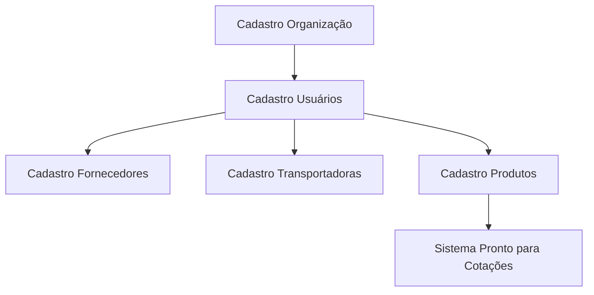
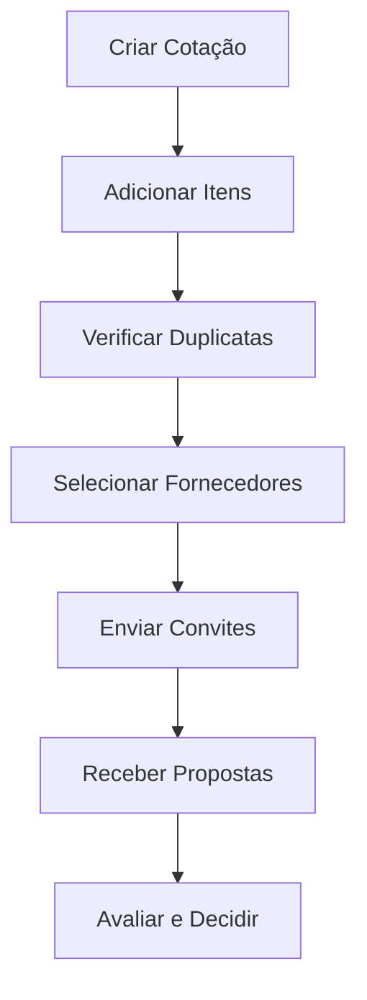

# Proposta de Estrutura de Banco de Dados para Sistema de Cotações Inteligentes

## 1. VISÃO GERAL DA ARQUITETURA DE DADOS

### 1.1 Estratégia Híbrida de Dados

Com base na arquitetura proposta no documento final.md, adotaremos uma estratégia híbrida que otimiza os recursos gratuitos disponíveis:

- **CosmosDB (Principal)**: Dados transacionais e históricos
- **Firebase Realtime Database**: Cache e operações em tempo real
- **Workers KV**: Cache de borda para consultas frequentes

### 1.2 Padrões de Nomenclatura

Seguindo as melhores práticas do PNCP (Portal Nacional de Contratações Públicas):

- Tabelas: `snake_case` em inglês para compatibilidade internacional
- Campos: `camelCase` no código, `snake_case` no banco
- IDs: UUIDs para distribuição global
- Campos de auditoria obrigatórios em todas as entidades

## 2. DEFINIÇÃO DAS ENTIDADES PRINCIPAIS

### 2.1 Gestão de Usuários e Organizações

````sql
-- Organizações/Empresas
CREATE TABLE organizations (
    id UUID PRIMARY KEY DEFAULT gen_random_uuid(),
    name VARCHAR(255) NOT NULL,
    cnpj VARCHAR(18) UNIQUE NOT NULL,
    email VARCHAR(255) NOT NULL,
    phone VARCHAR(20),
    address JSONB,
    subscription_plan VARCHAR(50) DEFAULT 'free',
    plan_limits JSONB DEFAULT '{
        "quotations_per_month": 500,
        "suppliers_limit": 100,
        "storage_gb": 5
    }',
    created_at TIMESTAMP DEFAULT CURRENT_TIMESTAMP,
    updated_at TIMESTAMP DEFAULT CURRENT_TIMESTAMP,
    deleted_at TIMESTAMP NULL
);

-- Usuários do Sistema
CREATE TABLE users (
    id UUID PRIMARY KEY DEFAULT gen_random_uuid(),
    organization_id UUID REFERENCES organizations(id),
    firebase_uid VARCHAR(255) UNIQUE NOT NULL,
    email VARCHAR(255) UNIQUE NOT NULL,
    name VARCHAR(255) NOT NULL,
    role ENUM('admin', 'manager', 'operator', 'viewer') DEFAULT 'operator',
    permissions JSONB DEFAULT '[]',
    last_login TIMESTAMP,
    is_active BOOLEAN DEFAULT true,
    created_at TIMESTAMP DEFAULT CURRENT_TIMESTAMP,
    updated_at TIMESTAMP DEFAULT CURRENT_TIMESTAMP
);
````

### 2.2 Gestão de Fornecedores e Transportadoras

````sql
-- Fornecedores
CREATE TABLE suppliers (
    id UUID PRIMARY KEY DEFAULT gen_random_uuid(),
    organization_id UUID REFERENCES organizations(id),
    name VARCHAR(255) NOT NULL,
    cnpj VARCHAR(18),
    cpf VARCHAR(14),
    type ENUM('pj', 'pf', 'mei') NOT NULL,
    email VARCHAR(255),
    phone VARCHAR(20),
    whatsapp VARCHAR(20),
    address JSONB,
    
    -- Performance e Histórico
    performance_score DECIMAL(3,2) DEFAULT 0.00,
    total_quotations INTEGER DEFAULT 0,
    response_rate DECIMAL(5,2) DEFAULT 0.00,
    avg_response_time_hours INTEGER DEFAULT 0,
    last_interaction TIMESTAMP,
    
    -- Categorias de Produtos/Serviços
    categories JSONB DEFAULT '[]',
    
    -- Status e Validações
    status ENUM('active', 'inactive', 'blocked') DEFAULT 'active',
    documents JSONB DEFAULT '{}',
    certifications JSONB DEFAULT '[]',
    
    -- Auditoria
    created_by UUID REFERENCES users(id),
    updated_by UUID REFERENCES users(id),
    created_at TIMESTAMP DEFAULT CURRENT_TIMESTAMP,
    updated_at TIMESTAMP DEFAULT CURRENT_TIMESTAMP,
    deleted_at TIMESTAMP NULL,
    
    INDEX idx_suppliers_org_status (organization_id, status),
    INDEX idx_suppliers_cnpj (cnpj),
    INDEX idx_suppliers_performance (performance_score DESC)
);

-- Transportadoras
CREATE TABLE carriers (
    id UUID PRIMARY KEY DEFAULT gen_random_uuid(),
    organization_id UUID REFERENCES organizations(id),
    name VARCHAR(255) NOT NULL,
    cnpj VARCHAR(18) UNIQUE NOT NULL,
    email VARCHAR(255),
    phone VARCHAR(20),
    
    -- Capacidades de Transporte
    service_areas JSONB DEFAULT '[]', -- Regiões atendidas
    vehicle_types JSONB DEFAULT '[]', -- Tipos de veículos
    specializations JSONB DEFAULT '[]', -- Cargas especiais
    
    -- Performance
    reliability_score DECIMAL(3,2) DEFAULT 0.00,
    avg_delivery_time_days INTEGER DEFAULT 0,
    
    status ENUM('active', 'inactive') DEFAULT 'active',
    created_at TIMESTAMP DEFAULT CURRENT_TIMESTAMP,
    updated_at TIMESTAMP DEFAULT CURRENT_TIMESTAMP
);
````

### 2.3 Gestão de Produtos e Itens

````sql
-- Catálogo de Produtos/Serviços
CREATE TABLE products (
    id UUID PRIMARY KEY DEFAULT gen_random_uuid(),
    organization_id UUID REFERENCES organizations(id),
    
    -- Identificação
    code VARCHAR(50) UNIQUE,
    name VARCHAR(255) NOT NULL,
    description TEXT,
    category VARCHAR(100),
    subcategory VARCHAR(100),
    
    -- Especificações Técnicas
    specifications JSONB DEFAULT '{}',
    unit_of_measure VARCHAR(20) NOT NULL, -- un, kg, m2, m3, etc.
    brand VARCHAR(100),
    model VARCHAR(100),
    
    -- Classificação Fiscal e Regulatória
    ncm_code VARCHAR(10),
    cest_code VARCHAR(10),
    service_code VARCHAR(20), -- Para serviços
    
    -- Preços de Referência (IA)
    avg_market_price DECIMAL(15,2),
    min_market_price DECIMAL(15,2),
    max_market_price DECIMAL(15,2),
    price_updated_at TIMESTAMP,
    
    -- Status e Auditoria
    status ENUM('active', 'inactive') DEFAULT 'active',
    created_by UUID REFERENCES users(id),
    created_at TIMESTAMP DEFAULT CURRENT_TIMESTAMP,
    updated_at TIMESTAMP DEFAULT CURRENT_TIMESTAMP,
    
    INDEX idx_products_org_category (organization_id, category),
    INDEX idx_products_code (code),
    FULLTEXT idx_products_search (name, description)
);
````

### 2.4 Sistema de Cotações - Entidades Principais

````sql
-- Cotações (Baseado no padrão PNCP)
CREATE TABLE quotations (
    id UUID PRIMARY KEY DEFAULT gen_random_uuid(),
    organization_id UUID REFERENCES organizations(id),
    
    -- Identificação PNCP
    pncp_id VARCHAR(50) UNIQUE, -- Ex: 08999690000146-1-000026/2025
    external_reference VARCHAR(100), -- Referência do edital original
    
    -- Dados Gerais
    title VARCHAR(255) NOT NULL,
    description TEXT,
    procurement_type ENUM(
        'pregao_eletronico', 
        'pregao_presencial', 
        'concorrencia', 
        'tomada_precos', 
        'convite', 
        'dispensa', 
        'inexigibilidade'
    ) NOT NULL,
    
    -- Órgão e Localização
    contracting_entity VARCHAR(255) NOT NULL,
    uasg_code VARCHAR(20),
    delivery_location JSONB, -- Endereço de entrega
    
    -- Prazos
    submission_deadline TIMESTAMP NOT NULL,
    opening_date TIMESTAMP,
    estimated_start_date DATE,
    estimated_duration_days INTEGER,
    
    -- Valores
    estimated_total_value DECIMAL(15,2),
    currency VARCHAR(3) DEFAULT 'BRL',
    
    -- Status do Fluxo Kanban
    status ENUM(
        'draft',          -- Rascunho
        'open',           -- Aberta
        'in_progress',    -- Em andamento
        'responded',      -- Respondida (pronta para proposta)
        'submitted',      -- Proposta enviada
        'awarded',        -- Adjudicada
        'finalized',      -- Finalizada
        'cancelled'       -- Cancelada
    ) DEFAULT 'draft',
    
    -- Controle de Workflow
    responsible_users JSONB DEFAULT '[]', -- Array de user IDs
    current_phase VARCHAR(50),
    
    -- Integração e Automação
    ai_analysis JSONB DEFAULT '{}', -- Análises da IA
    risk_score DECIMAL(3,2) DEFAULT 0.00,
    complexity_score DECIMAL(3,2) DEFAULT 0.00,
    
    -- Auditoria Completa
    created_by UUID REFERENCES users(id),
    updated_by UUID REFERENCES users(id),
    created_at TIMESTAMP DEFAULT CURRENT_TIMESTAMP,
    updated_at TIMESTAMP DEFAULT CURRENT_TIMESTAMP,
    deleted_at TIMESTAMP NULL,
    
    INDEX idx_quotations_org_status (organization_id, status),
    INDEX idx_quotations_deadline (submission_deadline),
    INDEX idx_quotations_pncp (pncp_id),
    FULLTEXT idx_quotations_search (title, description)
);

-- Itens da Cotação
CREATE TABLE quotation_items (
    id UUID PRIMARY KEY DEFAULT gen_random_uuid(),
    quotation_id UUID REFERENCES quotations(id) ON DELETE CASCADE,
    product_id UUID REFERENCES products(id),
    
    -- Detalhes do Item
    item_number INTEGER NOT NULL, -- Sequencial dentro da cotação
    description TEXT NOT NULL,
    specifications JSONB DEFAULT '{}',
    quantity DECIMAL(15,3) NOT NULL,
    unit_of_measure VARCHAR(20) NOT NULL,
    
    -- Valores de Referência
    estimated_unit_price DECIMAL(15,2),
    estimated_total_price DECIMAL(15,2),
    
    -- Critérios de Avaliação
    evaluation_criteria JSONB DEFAULT '{
        "technical_weight": 0.4,
        "price_weight": 0.6,
        "delivery_weight": 0.0
    }',
    
    -- Status de Cotação
    quotation_status ENUM(
        'pending',        -- Aguardando cotação
        'in_progress',    -- Em processo de cotação
        'quoted',         -- Cotado
        'cancelled'       -- Cancelado
    ) DEFAULT 'pending',
    
    -- Controle de Duplicidade
    hash_signature VARCHAR(64), -- Hash para detecção de duplicatas
    is_duplicate BOOLEAN DEFAULT false,
    original_item_id UUID REFERENCES quotation_items(id),
    
    created_at TIMESTAMP DEFAULT CURRENT_TIMESTAMP,
    updated_at TIMESTAMP DEFAULT CURRENT_TIMESTAMP,
    
    UNIQUE(quotation_id, item_number),
    INDEX idx_quotation_items_quotation (quotation_id),
    INDEX idx_quotation_items_product (product_id),
    INDEX idx_quotation_items_hash (hash_signature)
);
````

### 2.5 Sistema de Propostas e Cotações de Fornecedores

````sql
-- Convites para Cotação
CREATE TABLE quotation_invitations (
    id UUID PRIMARY KEY DEFAULT gen_random_uuid(),
    quotation_id UUID REFERENCES quotations(id) ON DELETE CASCADE,
    supplier_id UUID REFERENCES suppliers(id),
    
    -- Controle de Envio
    invitation_method ENUM('email', 'whatsapp', 'portal', 'manual') NOT NULL,
    sent_at TIMESTAMP DEFAULT CURRENT_TIMESTAMP,
    opened_at TIMESTAMP NULL,
    
    -- Status da Resposta
    response_status ENUM(
        'pending',        -- Aguardando resposta
        'viewed',         -- Visualizado
        'in_progress',    -- Em elaboração
        'submitted',      -- Proposta enviada
        'declined',       -- Declinou participar
        'expired'         -- Prazo expirado
    ) DEFAULT 'pending',
    
    -- Prazos
    response_deadline TIMESTAMP NOT NULL,
    reminded_at TIMESTAMP NULL,
    
    -- Tracking
    access_token VARCHAR(255) UNIQUE, -- Para acesso sem login
    ip_address INET,
    user_agent TEXT,
    
    created_by UUID REFERENCES users(id),
    created_at TIMESTAMP DEFAULT CURRENT_TIMESTAMP,
    updated_at TIMESTAMP DEFAULT CURRENT_TIMESTAMP,
    
    UNIQUE(quotation_id, supplier_id),
    INDEX idx_invitations_quotation (quotation_id),
    INDEX idx_invitations_supplier (supplier_id),
    INDEX idx_invitations_status (response_status)
);

-- Propostas dos Fornecedores
CREATE TABLE supplier_proposals (
    id UUID PRIMARY KEY DEFAULT gen_random_uuid(),
    quotation_id UUID REFERENCES quotations(id) ON DELETE CASCADE,
    quotation_invitation_id UUID REFERENCES quotation_invitations(id),
    supplier_id UUID REFERENCES suppliers(id),
    
    -- Dados da Proposta
    proposal_number VARCHAR(50),
    total_value DECIMAL(15,2) NOT NULL,
    currency VARCHAR(3) DEFAULT 'BRL',
    
    -- Prazos e Condições
    delivery_days INTEGER,
    payment_terms JSONB DEFAULT '{}',
    warranty_months INTEGER DEFAULT 0,
    
    -- Validade da Proposta
    valid_until DATE NOT NULL,
    
    -- Status e Avaliação
    status ENUM(
        'draft',          -- Rascunho
        'submitted',      -- Enviada
        'under_review',   -- Em análise
        'accepted',       -- Aceita
        'rejected',       -- Rejeitada
        'withdrawn'       -- Retirada pelo fornecedor
    ) DEFAULT 'draft',
    
    -- Pontuação (calculada automaticamente)
    technical_score DECIMAL(5,2) DEFAULT 0.00,
    price_score DECIMAL(5,2) DEFAULT 0.00,
    delivery_score DECIMAL(5,2) DEFAULT 0.00,
    final_score DECIMAL(5,2) DEFAULT 0.00,
    ranking_position INTEGER,
    
    -- Observações
    supplier_notes TEXT,
    internal_notes TEXT,
    
    -- Auditoria
    submitted_at TIMESTAMP,
    evaluated_at TIMESTAMP,
    evaluated_by UUID REFERENCES users(id),
    created_at TIMESTAMP DEFAULT CURRENT_TIMESTAMP,
    updated_at TIMESTAMP DEFAULT CURRENT_TIMESTAMP,
    
    INDEX idx_proposals_quotation (quotation_id),
    INDEX idx_proposals_supplier (supplier_id),
    INDEX idx_proposals_score (final_score DESC)
);

-- Itens das Propostas
CREATE TABLE proposal_items (
    id UUID PRIMARY KEY DEFAULT gen_random_uuid(),
    proposal_id UUID REFERENCES supplier_proposals(id) ON DELETE CASCADE,
    quotation_item_id UUID REFERENCES quotation_items(id),
    
    -- Preços e Quantidades
    unit_price DECIMAL(15,2) NOT NULL,
    total_price DECIMAL(15,2) NOT NULL,
    quantity DECIMAL(15,3) NOT NULL,
    
    -- Especificações Oferecidas
    brand VARCHAR(100),
    model VARCHAR(100),
    specifications JSONB DEFAULT '{}',
    
    -- Prazos Específicos do Item
    delivery_days INTEGER,
    
    -- Avaliação Técnica
    meets_specifications BOOLEAN DEFAULT true,
    technical_notes TEXT,
    compliance_score DECIMAL(3,2) DEFAULT 1.00,
    
    created_at TIMESTAMP DEFAULT CURRENT_TIMESTAMP,
    updated_at TIMESTAMP DEFAULT CURRENT_TIMESTAMP,
    
    UNIQUE(proposal_id, quotation_item_id),
    INDEX idx_proposal_items_proposal (proposal_id),
    INDEX idx_proposal_items_quotation_item (quotation_item_id)
);
````

### 2.6 Sistema de Anexos e Documentos

````sql
-- Anexos e Documentos
CREATE TABLE attachments (
    id UUID PRIMARY KEY DEFAULT gen_random_uuid(),
    
    -- Entidade Relacionada (polimórfico)
    attachable_type VARCHAR(50) NOT NULL, -- 'quotation', 'proposal', 'supplier'
    attachable_id UUID NOT NULL,
    
    -- Dados do Arquivo
    original_filename VARCHAR(255) NOT NULL,
    stored_filename VARCHAR(255) NOT NULL,
    file_path TEXT NOT NULL,
    mime_type VARCHAR(100),
    file_size BIGINT,
    
    -- Metadados
    document_type ENUM(
        'specification',
        'terms_of_reference', 
        'legal_document',
        'technical_drawing',
        'certificate',
        'proposal_document',
        'other'
    ) DEFAULT 'other',
    
    -- Processamento por IA
    ocr_text TEXT,
    extracted_data JSONB DEFAULT '{}',
    ai_analysis JSONB DEFAULT '{}',
    processing_status ENUM('pending', 'processing', 'completed', 'failed') DEFAULT 'pending',
    
    -- Controle de Acesso
    is_public BOOLEAN DEFAULT false,
    access_level ENUM('public', 'internal', 'confidential') DEFAULT 'internal',
    
    -- Auditoria
    uploaded_by UUID REFERENCES users(id),
    created_at TIMESTAMP DEFAULT CURRENT_TIMESTAMP,
    updated_at TIMESTAMP DEFAULT CURRENT_TIMESTAMP,
    
    INDEX idx_attachments_entity (attachable_type, attachable_id),
    INDEX idx_attachments_type (document_type),
    FULLTEXT idx_attachments_ocr (ocr_text)
);
````

### 2.7 Sistema de Comunicação e Histórico

````sql
-- Histórico de Ações (Audit Log)
CREATE TABLE audit_logs (
    id UUID PRIMARY KEY DEFAULT gen_random_uuid(),
    
    -- Entidade Afetada
    entity_type VARCHAR(50) NOT NULL,
    entity_id UUID NOT NULL,
    
    -- Detalhes da Ação
    action VARCHAR(50) NOT NULL, -- 'create', 'update', 'delete', 'send', etc.
    description TEXT,
    
    -- Dados da Mudança
    old_values JSONB,
    new_values JSONB,
    
    -- Contexto
    user_id UUID REFERENCES users(id),
    ip_address INET,
    user_agent TEXT,
    
    -- Timestamp
    created_at TIMESTAMP DEFAULT CURRENT_TIMESTAMP,
    
    INDEX idx_audit_entity (entity_type, entity_id),
    INDEX idx_audit_user (user_id),
    INDEX idx_audit_action (action),
    INDEX idx_audit_created (created_at DESC)
);

-- Comentários e Observações
CREATE TABLE comments (
    id UUID PRIMARY KEY DEFAULT gen_random_uuid(),
    
    -- Entidade Relacionada
    commentable_type VARCHAR(50) NOT NULL,
    commentable_id UUID NOT NULL,
    
    -- Conteúdo
    content TEXT NOT NULL,
    mentions JSONB DEFAULT '[]', -- Array de user IDs mencionados
    
    -- Hierarquia (para respostas)
    parent_comment_id UUID REFERENCES comments(id),
    thread_level INTEGER DEFAULT 0,
    
    -- Status
    is_internal BOOLEAN DEFAULT true, -- Interno ou visível para fornecedores
    is_resolved BOOLEAN DEFAULT false,
    
    -- Auditoria
    author_id UUID REFERENCES users(id),
    created_at TIMESTAMP DEFAULT CURRENT_TIMESTAMP,
    updated_at TIMESTAMP DEFAULT CURRENT_TIMESTAMP,
    deleted_at TIMESTAMP NULL,
    
    INDEX idx_comments_entity (commentable_type, commentable_id),
    INDEX idx_comments_author (author_id),
    INDEX idx_comments_created (created_at DESC)
);

-- Notificações
CREATE TABLE notifications (
    id UUID PRIMARY KEY DEFAULT gen_random_uuid(),
    user_id UUID REFERENCES users(id),
    
    -- Conteúdo
    title VARCHAR(255) NOT NULL,
    message TEXT,
    type ENUM('info', 'warning', 'success', 'error', 'reminder') DEFAULT 'info',
    
    -- Entidade Relacionada
    related_type VARCHAR(50),
    related_id UUID,
    
    -- Status
    is_read BOOLEAN DEFAULT false,
    read_at TIMESTAMP NULL,
    
    -- Canais de Entrega
    channels JSONB DEFAULT '["web"]', -- web, email, whatsapp
    sent_at TIMESTAMP NULL,
    delivery_status JSONB DEFAULT '{}',
    
    created_at TIMESTAMP DEFAULT CURRENT_TIMESTAMP,
    
    INDEX idx_notifications_user (user_id),
    INDEX idx_notifications_unread (user_id, is_read),
    INDEX idx_notifications_created (created_at DESC)
);
````

## 3. FLUXO DE DADOS E OPERAÇÕES

### 3.1 Fases do Sistema

#### Fase 1: Cadastro Base


#### Fase 2: Gestão de Cotações


### 3.2 Controle de Duplicidade

````sql
-- Função para gerar hash de item (PostgreSQL)
CREATE OR REPLACE FUNCTION generate_item_hash(
    p_description TEXT,
    p_specifications JSONB,
    p_unit_measure VARCHAR(20)
) RETURNS VARCHAR(64) AS $$
BEGIN
    RETURN encode(
        digest(
            LOWER(TRIM(p_description)) || 
            COALESCE(p_specifications::text, '') || 
            LOWER(TRIM(p_unit_measure)),
            'sha256'
        ),
        'hex'
    );
END;
$$ LANGUAGE plpgsql;

-- Trigger para detectar duplicatas automaticamente
CREATE OR REPLACE FUNCTION check_item_duplicates()
RETURNS TRIGGER AS $$
DECLARE
    duplicate_item_id UUID;
BEGIN
    -- Gerar hash do item
    NEW.hash_signature := generate_item_hash(
        NEW.description, 
        NEW.specifications, 
        NEW.unit_of_measure
    );
    
    -- Verificar duplicatas em cotações ativas da mesma organização
    SELECT qi.id INTO duplicate_item_id
    FROM quotation_items qi
    JOIN quotations q ON qi.quotation_id = q.id
    WHERE qi.hash_signature = NEW.hash_signature
      AND qi.id != COALESCE(NEW.id, '00000000-0000-0000-0000-000000000000'::UUID)
      AND q.organization_id = (
          SELECT organization_id 
          FROM quotations 
          WHERE id = NEW.quotation_id
      )
      AND q.status IN ('open', 'in_progress', 'responded')
      AND qi.quotation_status != 'cancelled'
    LIMIT 1;
    
    IF duplicate_item_id IS NOT NULL THEN
        NEW.is_duplicate := true;
        NEW.original_item_id := duplicate_item_id;
    END IF;
    
    RETURN NEW;
END;
$$ LANGUAGE plpgsql;

CREATE TRIGGER trigger_check_duplicates
    BEFORE INSERT OR UPDATE ON quotation_items
    FOR EACH ROW EXECUTE FUNCTION check_item_duplicates();
````

### 3.3 Integração com Frontend (Baseado em frontend.md)

#### 3.1 Estrutura para Kanban Board

````sql
-- View para o Kanban do Frontend
CREATE VIEW quotations_kanban AS
SELECT 
    q.id,
    q.title,
    q.description,
    q.status,
    q.submission_deadline,
    q.contracting_entity,
    q.estimated_total_value,
    q.created_at,
    q.updated_at,
    
    -- Contagem de itens
    COUNT(qi.id) as total_items,
    COUNT(CASE WHEN qi.quotation_status = 'quoted' THEN 1 END) as quoted_items,
    
    -- Fornecedores participantes
    COUNT(DISTINCT sp.supplier_id) as participating_suppliers,
    COUNT(CASE WHEN sp.status = 'submitted' THEN 1 END) as received_proposals,
    
    -- Responsáveis (array de nomes)
    ARRAY_AGG(DISTINCT u.name) as responsible_names,
    
    -- Próximas ações
    CASE 
        WHEN q.status = 'open' AND q.submission_deadline < NOW() + INTERVAL '24 hours' 
            THEN 'urgent_deadline'
        WHEN q.status = 'responded' AND COUNT(CASE WHEN sp.status = 'submitted' THEN 1 END) > 0 
            THEN 'ready_for_evaluation'
        WHEN q.status = 'in_progress' AND COUNT(qi.id) = COUNT(CASE WHEN qi.quotation_status = 'quoted' THEN 1 END)
            THEN 'ready_for_submission'
        ELSE 'normal'
    END as priority_flag

FROM quotations q
LEFT JOIN quotation_items qi ON q.id = qi.quotation_id AND qi.quotation_status != 'cancelled'
LEFT JOIN supplier_proposals sp ON q.id = sp.quotation_id
LEFT JOIN users u ON u.id = ANY(
    SELECT jsonb_array_elements_text(q.responsible_users)::UUID
)
WHERE q.deleted_at IS NULL
GROUP BY q.id, q.title, q.description, q.status, q.submission_deadline, 
         q.contracting_entity, q.estimated_total_value, q.created_at, q.updated_at;
````

#### 3.2 Integração PNCP (Seção 3 do frontend.md)

````sql
-- Tabela para cache de dados do PNCP
CREATE TABLE pncp_opportunities (
    id UUID PRIMARY KEY DEFAULT gen_random_uuid(),
    
    -- Identificação PNCP
    pncp_contracting_id VARCHAR(50) UNIQUE NOT NULL, -- 08999690000146-1-000026/2025
    notice_number VARCHAR(50) NOT NULL, -- 19/2025
    
    -- Dados do Órgão
    contracting_entity VARCHAR(255) NOT NULL,
    uasg_code VARCHAR(20),
    
    -- Detalhes da Contratação
    procurement_type VARCHAR(50),
    object_description TEXT,
    location VARCHAR(255),
    
    -- Prazos
    published_at TIMESTAMP,
    submission_deadline TIMESTAMP,
    opening_date TIMESTAMP,
    last_updated TIMESTAMP,
    
    -- Status de Integração
    integration_status ENUM('discovered', 'imported', 'ignored') DEFAULT 'discovered',
    imported_quotation_id UUID REFERENCES quotations(id),
    
    -- Cache dos dados originais
    raw_data JSONB,
    
    created_at TIMESTAMP DEFAULT CURRENT_TIMESTAMP,
    updated_at TIMESTAMP DEFAULT CURRENT_TIMESTAMP,
    
    INDEX idx_pncp_contracting_id (pncp_contracting_id),
    INDEX idx_pncp_deadline (submission_deadline),
    INDEX idx_pncp_status (integration_status),
    FULLTEXT idx_pncp_search (object_description, contracting_entity)
);

-- Função para importar oportunidade do PNCP
CREATE OR REPLACE FUNCTION import_pncp_opportunity(
    p_pncp_id VARCHAR(50),
    p_organization_id UUID,
    p_user_id UUID
) RETURNS UUID AS $$
DECLARE
    v_opportunity pncp_opportunities%ROWTYPE;
    v_quotation_id UUID;
BEGIN
    -- Buscar oportunidade
    SELECT * INTO v_opportunity 
    FROM pncp_opportunities 
    WHERE pncp_contracting_id = p_pncp_id;
    
    IF NOT FOUND THEN
        RAISE EXCEPTION 'Oportunidade PNCP não encontrada';
    END IF;
    
    -- Criar cotação
    INSERT INTO quotations (
        organization_id,
        pncp_id,
        title,
        description,
        procurement_type,
        contracting_entity,
        uasg_code,
        submission_deadline,
        opening_date,
        status,
        created_by
    ) VALUES (
        p_organization_id,
        v_opportunity.pncp_contracting_id,
        'Edital nº ' || v_opportunity.notice_number || ' - ' || v_opportunity.contracting_entity,
        v_opportunity.object_description,
        CASE v_opportunity.procurement_type
            WHEN 'Pregão - Eletrônico' THEN 'pregao_eletronico'
            ELSE 'concorrencia'
        END,
        v_opportunity.contracting_entity,
        v_opportunity.uasg_code,
        v_opportunity.submission_deadline,
        v_opportunity.opening_date,
        'open',
        p_user_id
    ) RETURNING id INTO v_quotation_id;
    
    -- Atualizar status da oportunidade
    UPDATE pncp_opportunities 
    SET integration_status = 'imported',
        imported_quotation_id = v_quotation_id,
        updated_at = CURRENT_TIMESTAMP
    WHERE pncp_contracting_id = p_pncp_id;
    
    RETURN v_quotation_id;
END;
$$ LANGUAGE plpgsql;
````

## Observação sobre Docker

Para ambientes de desenvolvimento, recomenda-se utilizar Docker para subir bancos de dados locais (PostgreSQL, Redis, etc.) e facilitar a integração entre os serviços do sistema. Utilize o arquivo `docker-compose.yml` na raiz do projeto para orquestrar todos os containers necessários.

Exemplo:
```bash
docker compose up
```

## 4. OTIMIZAÇÕES PARA ARQUITETURA HÍBRIDA

### 4.1 Estruturas para Firebase Realtime Database

````json
{
  "quotations_summary": {
    "organizationId": {
      "quotationId": {
        "title": "string",
        "status": "open|in_progress|responded|finalized|cancelled",
        "deadline": "timestamp",
        "totalValue": "number",
        "itemsCount": "number",
        "proposalsCount": "number",
        "lastUpdate": "timestamp",
        "responsibleUsers": ["userId1", "userId2"]
      }
    }
  },
  "live_notifications": {
    "userId": {
      "notificationId": {
        "type": "proposal_received|deadline_approaching|quotation_updated",
        "title": "string",
        "message": "string",
        "quotationId": "string",
        "timestamp": "timestamp",
        "read": false
      }
    }
  },
  "supplier_activity": {
    "quotationId": {
      "supplierId": {
        "status": "invited|viewing|responding|submitted",
        "lastSeen": "timestamp",
        "progressPercent": "number"
      }
    }
  }
}
````

### 4.2 Estruturas para Workers KV (Cache)

````typescript
// Tipos para cache no Cloudflare Workers KV
interface CachedSupplier {
  id: string;
  name: string;
  categories: string[];
  performanceScore: number;
  responseRate: number;
  lastCached: number;
}

interface CachedProduct {
  id: string;
  name: string;
  category: string;
  avgPrice: number;
  lastCached: number;
}

// Chaves do cache
const CACHE_KEYS = {
  suppliers: (orgId: string) => `suppliers:${orgId}`,
  products: (orgId: string, category: string) => `products:${orgId}:${category}`,
  quotation: (id: string) => `quotation:${id}`,
  duplicateCheck: (hash: string) => `duplicate:${hash}`
};
````

## 5. ÍNDICES E PERFORMANCE

### 5.1 Índices Estratégicos

````sql
-- Índices compostos para consultas frequentes
CREATE INDEX CONCURRENTLY idx_quotations_org_status_deadline 
ON quotations (organization_id, status, submission_deadline);

CREATE INDEX CONCURRENTLY idx_proposals_quotation_score 
ON supplier_proposals (quotation_id, final_score DESC) 
WHERE status = 'submitted';

CREATE INDEX CONCURRENTLY idx_items_duplicate_check 
ON quotation_items (hash_signature) 
WHERE is_duplicate = false;

-- Índices para busca full-text
CREATE INDEX CONCURRENTLY idx_quotations_fts 
ON quotations USING GIN(to_tsvector('portuguese', title || ' ' || description));

CREATE INDEX CONCURRENTLY idx_suppliers_fts 
ON suppliers USING GIN(to_tsvector('portuguese', name));
````

### 5.2 Particionamento para Escalabilidade

````sql
-- Particionamento por data para audit_logs
CREATE TABLE audit_logs_2025 PARTITION OF audit_logs
FOR VALUES FROM ('2025-01-01') TO ('2026-01-01');

-- Particionamento por organização para grandes volumes
CREATE TABLE quotations_large_orgs PARTITION OF quotations
FOR VALUES IN ('org-uuid-1', 'org-uuid-2', 'org-uuid-3');
````

## 6. TRIGGERS E AUTOMAÇÕES

### 6.1 Triggers para Auditoria Automática

````sql
-- Trigger genérico para audit log
CREATE OR REPLACE FUNCTION create_audit_log()
RETURNS TRIGGER AS $$
BEGIN
    INSERT INTO audit_logs (
        entity_type,
        entity_id,
        action,
        old_values,
        new_values,
        user_id
    ) VALUES (
        TG_TABLE_NAME,
        COALESCE(NEW.id, OLD.id),
        TG_OP,
        CASE WHEN TG_OP IN ('UPDATE', 'DELETE') THEN row_to_json(OLD) ELSE NULL END,
        CASE WHEN TG_OP IN ('INSERT', 'UPDATE') THEN row_to_json(NEW) ELSE NULL END,
        COALESCE(NEW.updated_by, NEW.created_by, OLD.updated_by)
    );
    
    RETURN COALESCE(NEW, OLD);
END;
$$ LANGUAGE plpgsql;

-- Aplicar a todas as tabelas principais
CREATE TRIGGER audit_quotations
    AFTER INSERT OR UPDATE OR DELETE ON quotations
    FOR EACH ROW EXECUTE FUNCTION create_audit_log();

CREATE TRIGGER audit_proposals
    AFTER INSERT OR UPDATE OR DELETE ON supplier_proposals
    FOR EACH ROW EXECUTE FUNCTION create_audit_log();
````

### 6.2 Triggers para Notificações Automáticas

````sql
-- Notificações automáticas para mudanças de status
CREATE OR REPLACE FUNCTION notify_status_change()
RETURNS TRIGGER AS $$
BEGIN
    -- Notificar mudança de status de cotação
    IF NEW.status != OLD.status THEN
        INSERT INTO notifications (
            user_id,
            title,
            message,
            type,
            related_type,
            related_id
        )
        SELECT 
            user_id::UUID,
            'Status da cotação alterado',
            'A cotação "' || NEW.title || '" mudou de ' || OLD.status || ' para ' || NEW.status,
            'info',
            'quotation',
            NEW.id
        FROM jsonb_array_elements_text(NEW.responsible_users) AS user_id;
    END IF;
    
    RETURN NEW;
END;
$$ LANGUAGE plpgsql;

CREATE TRIGGER notify_quotation_status_change
    AFTER UPDATE ON quotations
    FOR EACH ROW 
    WHEN (OLD.status IS DISTINCT FROM NEW.status)
    EXECUTE FUNCTION notify_status_change();
````

## 7. CONFORMIDADE E SEGURANÇA

### 7.1 Row Level Security (RLS)

````sql
-- Ativar RLS para isolamento por organização
ALTER TABLE quotations ENABLE ROW LEVEL SECURITY;
ALTER TABLE suppliers ENABLE ROW LEVEL SECURITY;
ALTER TABLE supplier_proposals ENABLE ROW LEVEL SECURITY;

-- Política para usuários verem apenas dados de sua organização
CREATE POLICY quotations_org_isolation ON quotations
    FOR ALL TO application_role
    USING (organization_id = current_setting('app.current_organization_id')::UUID);

CREATE POLICY suppliers_org_isolation ON suppliers
    FOR ALL TO application_role
    USING (organization_id = current_setting('app.current_organization_id')::UUID);
````

### 7.2 Conformidade LGPD

````sql
-- Campos para controle LGPD
ALTER TABLE suppliers ADD COLUMN lgpd_consent_date TIMESTAMP;
ALTER TABLE suppliers ADD COLUMN lgpd_consent_version VARCHAR(10);
ALTER TABLE suppliers ADD COLUMN data_retention_until DATE;

-- Função para anonização de dados
CREATE OR REPLACE FUNCTION anonymize_supplier_data(p_supplier_id UUID)
RETURNS VOID AS $$
BEGIN
    UPDATE suppliers SET
        name = 'DADOS REMOVIDOS',
        email = 'removido@' || id::text || '.com',
        phone = NULL,
        whatsapp = NULL,
        address = '{}',
        documents = '{}',
        deleted_at = CURRENT_TIMESTAMP
    WHERE id = p_supplier_id;
    
    -- Log da ação
    INSERT INTO audit_logs (entity_type, entity_id, action, description)
    VALUES ('suppliers', p_supplier_id, 'anonymize', 'Dados anonimizados por solicitação LGPD');
END;
$$ LANGUAGE plpgsql;
````

## 8. SISTEMA DE CONTROLE DE COBRANÇA E FATURAMENTO PARA APIs

### 8.1 Visão Geral da Arquitetura de Cobrança

O sistema de cobrança para APIs será implementado seguindo os princípios de:
- **Transparência**: Todo consumo será registrado e auditável
- **Escalabilidade**: Suporte a milhões de chamadas sem impacto na performance
- **Flexibilidade**: Diferentes modelos de cobrança por tipo de cliente
- **Conformidade**: Atendimento às normas fiscais e tributárias brasileiras
- **Faturamento Detalhado**: Geração automática de faturas, histórico de pagamentos e relatórios financeiros
- **Integração com Gateways**: Suporte a múltiplos gateways de pagamento (Stripe, Mercado Pago, etc.)

### 8.2 Entidades do Sistema de Cobrança

#### 8.2.1 Clientes API e Planos de Cobrança

````sql
-- Clientes da API (externos ao sistema principal)
CREATE TABLE api_clients (
    id UUID PRIMARY KEY DEFAULT gen_random_uuid(),
    
    -- Identificação do Cliente
    client_name VARCHAR(255) NOT NULL,
    cnpj VARCHAR(18) UNIQUE,
    cpf VARCHAR(14),
    client_type ENUM('government', 'private_company', 'startup', 'individual') NOT NULL,
    
    -- Dados de Contato
    email VARCHAR(255) NOT NULL,
    phone VARCHAR(20),
    billing_address JSONB,
    
    -- Credenciais de API
    api_key VARCHAR(255) UNIQUE NOT NULL,
    api_secret_hash VARCHAR(512) NOT NULL, -- Hash da secret
    
    -- Status e Configurações
    status ENUM('active', 'suspended', 'cancelled') DEFAULT 'active',
    rate_limit_per_minute INTEGER DEFAULT 100,
    rate_limit_per_day INTEGER DEFAULT 10000,
    
    -- Plano de Cobrança
    billing_plan_id UUID REFERENCES billing_plans(id),
    billing_cycle ENUM('monthly', 'quarterly', 'annual') DEFAULT 'monthly',
    billing_day INTEGER DEFAULT 1, -- Dia do mês para cobrança
    
    -- Controle de Créditos (pré-pago)
    prepaid_credits DECIMAL(15,2) DEFAULT 0.00,
    credit_threshold DECIMAL(15,2) DEFAULT 100.00, -- Alerta quando créditos < threshold
    
    -- Auditoria
    created_by UUID REFERENCES users(id),
    created_at TIMESTAMP DEFAULT CURRENT_TIMESTAMP,
    updated_at TIMESTAMP DEFAULT CURRENT_TIMESTAMP,
    deleted_at TIMESTAMP NULL,
    
    INDEX idx_api_clients_key (api_key),
    INDEX idx_api_clients_cnpj (cnpj),
    INDEX idx_api_clients_status (status)
);

-- Planos de Cobrança com detalhamento completo de upgrade/downgrade
CREATE TABLE billing_plans (
    id UUID PRIMARY KEY DEFAULT gen_random_uuid(),
    
    -- Identificação do Plano
    name VARCHAR(100) NOT NULL,
    description TEXT,
    plan_type ENUM('free', 'basic', 'professional', 'enterprise', 'custom') NOT NULL,
    
    -- Preços e Trial
    monthly_price DECIMAL(15,2) NOT NULL DEFAULT 0.00,
    yearly_price DECIMAL(15,2),
    trial_period_days INTEGER DEFAULT 7,
    setup_fee DECIMAL(10,2) DEFAULT 0.00,
    
    -- Limites do Plano  
    monthly_requests_limit INTEGER DEFAULT 1000,
    daily_requests_limit INTEGER DEFAULT 100,
    concurrent_requests_limit INTEGER DEFAULT 10,
    
    -- Configurações Avançadas
    features JSONB DEFAULT '{}', -- Features incluídas no plano
    upgrade_notifications JSONB DEFAULT '{}', -- Configurações de notificações
    downgrade_policy JSONB DEFAULT '{}', -- Política de downgrade
    payment_gateways JSONB DEFAULT '["stripe", "mercado_pago"]', -- Gateways suportados
    support_level ENUM('community', 'email', 'priority', 'dedicated') DEFAULT 'community',
    
    -- Status
    is_active BOOLEAN DEFAULT true,
    created_at TIMESTAMP DEFAULT CURRENT_TIMESTAMP,
    updated_at TIMESTAMP DEFAULT CURRENT_TIMESTAMP,
    
    INDEX idx_billing_plans_type (plan_type),
    INDEX idx_billing_plans_active (is_active),
    INDEX idx_billing_plans_price (monthly_price)
);

-- Tabela de controle de upgrades de plano
CREATE TABLE plan_upgrades (
    id UUID PRIMARY KEY DEFAULT gen_random_uuid(),
    user_id UUID NOT NULL REFERENCES users(id),
    from_plan_id UUID REFERENCES billing_plans(id),
    to_plan_id UUID NOT NULL REFERENCES billing_plans(id),
    upgrade_type ENUM('trial_to_paid', 'upgrade', 'downgrade', 'reactivation') NOT NULL,
    payment_status ENUM('pending', 'processing', 'completed', 'failed', 'cancelled') DEFAULT 'pending',
    payment_method VARCHAR(50),
    gateway_transaction_id VARCHAR(255),
    gateway_name ENUM('stripe', 'mercado_pago', 'pagseguro', 'cielo') NOT NULL,
    amount DECIMAL(15,2) NOT NULL,
    currency VARCHAR(3) DEFAULT 'BRL',
    upgrade_date TIMESTAMP DEFAULT CURRENT_TIMESTAMP,
    effective_date TIMESTAMP,
    notification_sent BOOLEAN DEFAULT false,
    receipt_sent BOOLEAN DEFAULT false,
    feedback_visual_status JSONB DEFAULT '{}', -- Status visual para cada etapa
    created_at TIMESTAMP DEFAULT CURRENT_TIMESTAMP,
    updated_at TIMESTAMP DEFAULT CURRENT_TIMESTAMP,
    INDEX idx_plan_upgrades_user (user_id),
    INDEX idx_plan_upgrades_status (payment_status),
    INDEX idx_plan_upgrades_date (upgrade_date DESC)
);

-- Tabela de Preços por Serviço/Endpoint
CREATE TABLE api_pricing (
    id UUID PRIMARY KEY DEFAULT gen_random_uuid(),
    billing_plan_id UUID REFERENCES billing_plans(id),
    
    -- Identificação do Serviço
    service_name VARCHAR(100) NOT NULL, -- 'pncp_search', 'supplier_analysis', etc.
    endpoint_pattern VARCHAR(255) NOT NULL, -- '/api/v1/pncp/search'
    http_method VARCHAR(10) DEFAULT 'GET',
    
    -- Modelo de Cobrança
    pricing_model ENUM(
        'per_request',        -- Por requisição
        'per_result',         -- Por resultado retornado
        'per_data_volume',    -- Por volume de dados (MB)
        'per_processing_time', -- Por tempo de processamento
        'flat_rate'           -- Taxa fixa
    ) NOT NULL,
    
    -- Preços
    unit_price DECIMAL(10,4) NOT NULL, -- Preço por unidade
    minimum_charge DECIMAL(10,2) DEFAULT 0.00,
    
    -- Faixas de Desconto (pricing tier)
    volume_tiers JSONB DEFAULT '[]', -- Ex: [{"from": 1000, "to": 5000, "discount": 0.1}]
    
    -- Configurações
    is_billable BOOLEAN DEFAULT true,
    requires_authentication BOOLEAN DEFAULT true,
    
    created_at TIMESTAMP DEFAULT CURRENT_TIMESTAMP,
    updated_at TIMESTAMP DEFAULT CURRENT_TIMESTAMP,
    
    UNIQUE(billing_plan_id, service_name, endpoint_pattern),
    INDEX idx_api_pricing_service (service_name),
    INDEX idx_api_pricing_endpoint (endpoint_pattern)
);
````

#### 8.2.2 Sistema de Registro de Chamadas (API Logs)

````sql
-- Log de Chamadas da API (Particionado por mês)
CREATE TABLE api_usage_logs (
    id UUID PRIMARY KEY DEFAULT gen_random_uuid(),
    
    -- Identificação da Chamada
    api_client_id UUID REFERENCES api_clients(id),
    request_id VARCHAR(50) UNIQUE NOT NULL, -- UUID da requisição
    
    -- Detalhes da Requisição
    endpoint VARCHAR(255) NOT NULL,
    http_method VARCHAR(10) NOT NULL,
    service_name VARCHAR(100) NOT NULL,
    
    -- Dados da Requisição
    request_timestamp TIMESTAMP DEFAULT CURRENT_TIMESTAMP,
    ip_address INET,
    user_agent TEXT,
    request_headers JSONB,
    request_body_size INTEGER DEFAULT 0,
    
    -- Dados da Resposta
    response_status INTEGER,
    response_timestamp TIMESTAMP,
    response_body_size INTEGER DEFAULT 0,
    processing_time_ms INTEGER,
    
    -- Métricas para Cobrança
    results_count INTEGER DEFAULT 0, -- Quantos resultados foram retornados
    data_volume_mb DECIMAL(10,3) DEFAULT 0.000, -- Volume de dados processados
    complexity_score DECIMAL(5,2) DEFAULT 1.00, -- Score de complexidade da consulta
    
    -- Cobrança Calculada
    billable_units DECIMAL(15,3) DEFAULT 0.000,
    unit_price DECIMAL(10,4) DEFAULT 0.0000,
    calculated_cost DECIMAL(15,4) DEFAULT 0.0000,
    
    -- Status da Cobrança
    billing_status ENUM('pending', 'calculated', 'billed', 'credited') DEFAULT 'pending',
    billed_at TIMESTAMP NULL,
    invoice_id UUID REFERENCES invoices(id),
    
    -- Metadados
    api_version VARCHAR(10) DEFAULT 'v1',
    client_sdk_version VARCHAR(20),
    error_code VARCHAR(50),
    error_message TEXT,
    
    INDEX idx_api_usage_client_date (api_client_id, request_timestamp),
    INDEX idx_api_usage_service_date (service_name, request_timestamp),
    INDEX idx_api_usage_billing_status (billing_status),
    INDEX idx_api_usage_timestamp (request_timestamp DESC)
) PARTITION BY RANGE (request_timestamp);

-- Partições mensais para performance
CREATE TABLE api_usage_logs_2025_01 PARTITION OF api_usage_logs
FOR VALUES FROM ('2025-01-01') TO ('2025-02-01');

CREATE TABLE api_usage_logs_2025_02 PARTITION OF api_usage_logs
FOR VALUES FROM ('2025-02-01') TO ('2025-03-01');

-- Agregação diária para relatórios rápidos
CREATE TABLE api_usage_daily_summary (
    id UUID PRIMARY KEY DEFAULT gen_random_uuid(),
    api_client_id UUID REFERENCES api_clients(id),
    usage_date DATE NOT NULL,
    
    -- Contadores
    total_requests INTEGER DEFAULT 0,
    successful_requests INTEGER DEFAULT 0,
    failed_requests INTEGER DEFAULT 0,
    
    -- Métricas por Serviço
    service_usage JSONB DEFAULT '{}', -- {"pncp_search": {"requests": 100, "cost": 25.50}}
    
    -- Totais de Cobrança
    total_billable_units DECIMAL(15,3) DEFAULT 0.000,
    total_calculated_cost DECIMAL(15,2) DEFAULT 0.00,
    
    -- Performance
    avg_response_time_ms INTEGER DEFAULT 0,
    total_data_volume_mb DECIMAL(15,3) DEFAULT 0.000,
    
    created_at TIMESTAMP DEFAULT CURRENT_TIMESTAMP,
    
    UNIQUE(api_client_id, usage_date),
    INDEX idx_usage_summary_client_date (api_client_id, usage_date),
    INDEX idx_usage_summary_date (usage_date DESC)
);
````

#### 8.2.3 Sistema de Faturamento

````sql
-- Faturas/Invoices com detalhamento completo
CREATE TABLE invoices (
    id UUID PRIMARY KEY DEFAULT gen_random_uuid(),
    api_client_id UUID REFERENCES api_clients(id),
    
    -- Identificação da Fatura
    invoice_number VARCHAR(50) UNIQUE NOT NULL, -- 2025/001, 2025/002...
    invoice_type ENUM('monthly', 'usage', 'setup', 'credit_purchase', 'plan_upgrade') NOT NULL,
    
    -- Período de Cobrança
    billing_period_start DATE NOT NULL,
    billing_period_end DATE NOT NULL,
    
    -- Valores
    subtotal DECIMAL(15,2) NOT NULL,
    discount_amount DECIMAL(15,2) DEFAULT 0.00,
    tax_amount DECIMAL(15,2) DEFAULT 0.00, -- ISS, PIS, COFINS, etc.
    total_amount DECIMAL(15,2) NOT NULL,
    currency VARCHAR(3) DEFAULT 'BRL',
    
    -- Status e Prazos
    status ENUM('draft', 'sent', 'paid', 'overdue', 'cancelled', 'credited') DEFAULT 'draft',
    issued_date DATE NOT NULL,
    due_date DATE NOT NULL,
    paid_date DATE NULL,
    
    -- Integração com Gateways
    payment_gateway ENUM('stripe', 'mercado_pago', 'pagseguro', 'cielo'),
    gateway_invoice_id VARCHAR(255),
    payment_url TEXT, -- URL para pagamento
    receipt_url TEXT, -- URL do recibo
    
    -- Detalhes Fiscais e Relatórios Financeiros
    tax_document_number VARCHAR(50), -- Número da NFS-e
    tax_document_url TEXT,
    tax_breakdown JSONB DEFAULT '{}',
    financial_report_data JSONB DEFAULT '{}', -- Dados para relatórios financeiros
    
    -- Histórico de pagamentos e notificações
    payment_history JSONB DEFAULT '[]', -- Histórico de tentativas
    notification_history JSONB DEFAULT '[]', -- Histórico de notificações enviadas
    
    -- Observações
    notes TEXT,
    payment_instructions TEXT,
    
    -- Auditoria
    created_by UUID REFERENCES users(id),
    created_at TIMESTAMP DEFAULT CURRENT_TIMESTAMP,
    updated_at TIMESTAMP DEFAULT CURRENT_TIMESTAMP,
    
    INDEX idx_invoices_client (api_client_id),
    INDEX idx_invoices_number (invoice_number),
    INDEX idx_invoices_status_date (status, due_date),
    INDEX idx_invoices_period (billing_period_start, billing_period_end),
    INDEX idx_invoices_gateway (payment_gateway)
);

-- Itens da Fatura
CREATE TABLE invoice_items (
    id UUID PRIMARY KEY DEFAULT gen_random_uuid(),
    invoice_id UUID REFERENCES invoices(id) ON DELETE CASCADE,
    
    -- Descrição do Item
    description TEXT NOT NULL,
    service_name VARCHAR(100),
    
    -- Quantidades e Preços
    quantity DECIMAL(15,3) NOT NULL,
    unit_price DECIMAL(10,4) NOT NULL,
    line_total DECIMAL(15,2) NOT NULL,
    
    -- Período do Item (se aplicável)
    item_period_start DATE,
    item_period_end DATE,
    
    -- Detalhamento (para auditoria)
    usage_details JSONB DEFAULT '{}', -- Breakdown detalhado do uso
    
    created_at TIMESTAMP DEFAULT CURRENT_TIMESTAMP,
    
    INDEX idx_invoice_items_invoice (invoice_id),
    INDEX idx_invoice_items_service (service_name)
);

-- Histórico de Pagamentos
CREATE TABLE payments (
    id UUID PRIMARY KEY DEFAULT gen_random_uuid(),
    invoice_id UUID REFERENCES invoices(id),
    api_client_id UUID REFERENCES api_clients(id),
    
    -- Dados do Pagamento
    payment_amount DECIMAL(15,2) NOT NULL,
    payment_method ENUM('bank_transfer', 'credit_card', 'pix', 'boleto', 'credit_adjustment') NOT NULL,
    payment_date DATE NOT NULL,
    
    -- Referências Externas
    external_payment_id VARCHAR(100), -- ID do gateway de pagamento
    bank_reference VARCHAR(100),
    
    -- Status
    payment_status ENUM('pending', 'confirmed', 'failed', 'refunded') DEFAULT 'pending',
    
    -- Observações
    notes TEXT,
    
    created_at TIMESTAMP DEFAULT CURRENT_TIMESTAMP,
    
    INDEX idx_payments_invoice (invoice_id),
    INDEX idx_payments_client_date (api_client_id, payment_date)
);
````

### 8.3 Funções de Processamento de Cobrança

#### 8.3.1 Cálculo Automático de Custos

````sql
-- Função para calcular custo de uma chamada API
CREATE OR REPLACE FUNCTION calculate_api_call_cost(
    p_api_client_id UUID,
    p_service_name VARCHAR(100),
    p_results_count INTEGER,
    p_data_volume_mb DECIMAL(10,3),
    p_processing_time_ms INTEGER
) RETURNS TABLE(
    billable_units DECIMAL(15,3),
    unit_price DECIMAL(10,4),
    calculated_cost DECIMAL(15,4)
) AS $$
DECLARE
    v_pricing api_pricing%ROWTYPE;
    v_client api_clients%ROWTYPE;
    v_monthly_usage DECIMAL(15,3);
    v_discount_rate DECIMAL(5,4) := 0.0000;
BEGIN
    -- Buscar cliente e suas configurações
    SELECT * INTO v_client FROM api_clients WHERE id = p_api_client_id;
    
    -- Buscar preço do serviço para o plano do cliente
    SELECT ap.* INTO v_pricing
    FROM api_pricing ap
    WHERE ap.billing_plan_id = v_client.billing_plan_id
      AND ap.service_name = p_service_name
      AND ap.is_billable = true;
    
    IF NOT FOUND THEN
        -- Serviço não encontrado ou não cobrável
        RETURN QUERY SELECT 0::DECIMAL(15,3), 0::DECIMAL(10,4), 0::DECIMAL(15,4);
        RETURN;
    END IF;
    
    -- Calcular unidades cobráveis baseado no modelo
    billable_units := CASE v_pricing.pricing_model
        WHEN 'per_request' THEN 1
        WHEN 'per_result' THEN p_results_count
        WHEN 'per_data_volume' THEN p_data_volume_mb
        WHEN 'per_processing_time' THEN (p_processing_time_ms::DECIMAL / 1000) -- segundos
        WHEN 'flat_rate' THEN 1
        ELSE 1
    END;
    
    -- Verificar desconto por volume (se configurado)
    IF v_pricing.volume_tiers IS NOT NULL THEN
        -- Buscar uso mensal atual do cliente para este serviço
        SELECT COALESCE(SUM(uls.billable_units), 0) INTO v_monthly_usage
        FROM api_usage_logs uls
        WHERE uls.api_client_id = p_api_client_id
          AND uls.service_name = p_service_name
          AND uls.request_timestamp >= DATE_TRUNC('month', CURRENT_DATE);
        
        -- Aplicar desconto baseado no tier de volume
        SELECT tier->>'discount' INTO v_discount_rate
        FROM jsonb_array_elements(v_pricing.volume_tiers) AS tier
        WHERE (tier->>'from')::INTEGER <= v_monthly_usage
          AND (tier->>'to')::INTEGER > v_monthly_usage
        ORDER BY (tier->>'from')::INTEGER DESC
        LIMIT 1;
    END IF;
    
    -- Calcular preço unitário com desconto
    unit_price := v_pricing.unit_price * (1 - COALESCE(v_discount_rate, 0));
    
    -- Calcular custo total
    calculated_cost := billable_units * unit_price;
    
    -- Aplicar valor mínimo se configurado
    IF calculated_cost < v_pricing.minimum_charge THEN
        calculated_cost := v_pricing.minimum_charge;
    END IF;
    
    RETURN QUERY SELECT billable_units, unit_price, calculated_cost;
END;
$$ LANGUAGE plpgsql;

-- Trigger para calcular custo automaticamente ao registrar uso
CREATE OR REPLACE FUNCTION auto_calculate_api_cost()
RETURNS TRIGGER AS $$
DECLARE
    v_cost_result RECORD;
BEGIN
    -- Calcular custo apenas se ainda não foi calculado
    IF NEW.billing_status = 'pending' THEN
        SELECT * INTO v_cost_result
        FROM calculate_api_call_cost(
            NEW.api_client_id,
            NEW.service_name,
            NEW.results_count,
            NEW.data_volume_mb,
            NEW.processing_time_ms
        );
        
        NEW.billable_units := v_cost_result.billable_units;
        NEW.unit_price := v_cost_result.unit_price;
        NEW.calculated_cost := v_cost_result.calculated_cost;
        NEW.billing_status := 'calculated';
    END IF;
    
    RETURN NEW;
END;
$$ LANGUAGE plpgsql;

CREATE TRIGGER trigger_auto_calculate_cost
    BEFORE INSERT OR UPDATE ON api_usage_logs
    FOR EACH ROW EXECUTE FUNCTION auto_calculate_api_cost();
````

#### 8.3.2 Geração Automática de Faturas

````sql
-- Função para gerar fatura mensal
CREATE OR REPLACE FUNCTION generate_monthly_invoice(
    p_api_client_id UUID,
    p_billing_month DATE
) RETURNS UUID AS $$
DECLARE
    v_invoice_id UUID;
    v_client api_clients%ROWTYPE;
    v_plan billing_plans%ROWTYPE;
    v_usage_summary RECORD;
    v_invoice_number VARCHAR(50);
    v_subtotal DECIMAL(15,2) := 0.00;
    v_total DECIMAL(15,2) := 0.00;
    v_tax_amount DECIMAL(15,2) := 0.00;
BEGIN
    -- Buscar dados do cliente
    SELECT * INTO v_client FROM api_clients WHERE id = p_api_client_id;
    SELECT * INTO v_plan FROM billing_plans WHERE id = v_client.billing_plan_id;
    
    -- Gerar número da fatura
    SELECT 'INV-' || TO_CHAR(p_billing_month, 'YYYY-MM') || '-' || 
           LPAD(COALESCE(MAX(CAST(SPLIT_PART(invoice_number, '-', 4) AS INTEGER)), 0) + 1, 6, '0')
    INTO v_invoice_number
    FROM invoices 
    WHERE invoice_number LIKE 'INV-' || TO_CHAR(p_billing_month, 'YYYY-MM') || '-%';
    
    -- Criar fatura
    INSERT INTO invoices (
        api_client_id,
        invoice_number,
        invoice_type,
        billing_period_start,
        billing_period_end,
        subtotal,
        total_amount,
        status,
        issued_date,
        due_date
    ) VALUES (
        p_api_client_id,
        v_invoice_number,
        'monthly',
        DATE_TRUNC('month', p_billing_month),
        (DATE_TRUNC('month', p_billing_month) + INTERVAL '1 month - 1 day')::DATE,
        0, -- Será calculado depois
        0, -- Será calculado depois
        'draft',
        CURRENT_DATE,
        CURRENT_DATE + INTERVAL '30 days'
    ) RETURNING id INTO v_invoice_id;
    
    -- Adicionar taxa mensal do plano (se houver)
    IF v_plan.monthly_fee > 0 THEN
        INSERT INTO invoice_items (
            invoice_id,
            description,
            service_name,
            quantity,
            unit_price,
            line_total,
            item_period_start,
            item_period_end
        ) VALUES (
            v_invoice_id,
            'Plano ' || v_plan.name || ' - Taxa Mensal',
            'monthly_fee',
            1,
            v_plan.monthly_fee,
            v_plan.monthly_fee,
            DATE_TRUNC('month', p_billing_month),
            (DATE_TRUNC('month', p_billing_month) + INTERVAL '1 month - 1 day')::DATE
        );
        
        v_subtotal := v_subtotal + v_plan.monthly_fee;
    END IF;
    
    -- Adicionar custos de uso da API
    FOR v_usage_summary IN
        SELECT 
            service_name,
            SUM(billable_units) as total_units,
            AVG(unit_price) as avg_unit_price,
            SUM(calculated_cost) as total_cost,
            COUNT(*) as total_calls
        FROM api_usage_logs
        WHERE api_client_id = p_api_client_id
          AND request_timestamp >= DATE_TRUNC('month', p_billing_month)
          AND request_timestamp < DATE_TRUNC('month', p_billing_month) + INTERVAL '1 month'
          AND billing_status = 'calculated'
        GROUP BY service_name
    LOOP
        INSERT INTO invoice_items (
            invoice_id,
            description,
            service_name,
            quantity,
            unit_price,
            line_total,
            item_period_start,
            item_period_end,
            usage_details
        ) VALUES (
            v_invoice_id,
            'Uso da API - ' || v_usage_summary.service_name,
            v_usage_summary.service_name,
            v_usage_summary.total_units,
            v_usage_summary.avg_unit_price,
            v_usage_summary.total_cost,
            DATE_TRUNC('month', p_billing_month),
            (DATE_TRUNC('month', p_billing_month) + INTERVAL '1 month - 1 day')::DATE,
            jsonb_build_object(
                'total_calls', v_usage_summary.total_calls,
                'total_units', v_usage_summary.total_units
            )
        );
        
        v_subtotal := v_subtotal + v_usage_summary.total_cost;
    END LOOP;
    
    -- Calcular impostos (exemplo: ISS 5%)
    v_tax_amount := v_subtotal * 0.05;
    v_total := v_subtotal + v_tax_amount;
    
    -- Atualizar totais da fatura
    UPDATE invoices SET
        subtotal = v_subtotal,
        tax_amount = v_tax_amount,
        total_amount = v_total,
        status = 'sent',
        updated_at = CURRENT_TIMESTAMP
    WHERE id = v_invoice_id;
    
    -- Marcar logs como faturados
    UPDATE api_usage_logs SET
        billing_status = 'billed',
        billed_at = CURRENT_TIMESTAMP,
        invoice_id = v_invoice_id
    WHERE api_client_id = p_api_client_id
      AND request_timestamp >= DATE_TRUNC('month', p_billing_month)
      AND request_timestamp < DATE_TRUNC('month', p_billing_month) + INTERVAL '1 month'
      AND billing_status = 'calculated';
    
    RETURN v_invoice_id;
END;
$$ LANGUAGE plpgsql;
````

### 8.4 Integração com a Infraestrutura Existente

#### 8.4.1 Middleware de Autenticação e Logging

````typescript
// Middleware para Express.js/Fastify
interface APIBillingMiddleware {
  // Autenticação e identificação do cliente
  authenticateClient(apiKey: string): Promise<APIClient | null>;
  
  // Log da requisição com dados para cobrança
  logAPICall(request: {
    clientId: string;
    endpoint: string;
    method: string;
    serviceName: string;
    startTime: Date;
    ipAddress: string;
    userAgent: string;
    requestSize: number;
  }): Promise<string>; // Retorna request_id
  
  // Log da resposta com métricas finais
  logAPIResponse(requestId: string, response: {
    statusCode: number;
    responseSize: number;
    resultsCount: number;
    dataVolumeMB: number;
    endTime: Date;
    errorCode?: string;
  }): Promise<void>;
  
  // Verificação de limites
  checkRateLimits(clientId: string): Promise<boolean>;
  checkCredits(clientId: string): Promise<boolean>;
}

// Implementação usando Workers KV para cache
class CloudflareAPIBillingMiddleware implements APIBillingMiddleware {
  private kv: KVNamespace;
  private db: DatabaseConnection;
  
  async authenticateClient(apiKey: string): Promise<APIClient | null> {
    // Cache no KV por 5 minutos
    const cacheKey = `auth:${apiKey}`;
    const cached = await this.kv.get(cacheKey);
    
    if (cached) {
      return JSON.parse(cached);
    }
    
    // Buscar no banco
    const client = await this.db.query(
      'SELECT * FROM api_clients WHERE api_key = $1 AND status = $2',
      [apiKey, 'active']
    );
    
    if (client) {
      await this.kv.put(cacheKey, JSON.stringify(client), { expirationTtl: 300 });
    }
    
    return client;
  }
  
  async logAPICall(request: any): Promise<string> {
    const requestId = crypto.randomUUID();
    
    // Log assíncrono para não bloquear a requisição
    this.asyncLogCall(requestId, request);
    
    return requestId;
  }
  
  private async asyncLogCall(requestId: string, request: any): Promise<void> {
    // Usar queue/worker para processamento assíncrono
    await this.addToProcessingQueue({
      type: 'api_call_start',
      requestId,
      ...request
    });
  }
}
````

#### 8.4.2 Cache e Performance

````sql
-- Views materializadas para relatórios rápidos
CREATE MATERIALIZED VIEW api_usage_monthly_summary AS
SELECT 
    api_client_id,
    DATE_TRUNC('month', request_timestamp) as billing_month,
    service_name,
    COUNT(*) as total_requests,
    SUM(CASE WHEN response_status BETWEEN 200 AND 299 THEN 1 ELSE 0 END) as successful_requests,
    SUM(billable_units) as total_billable_units,
    SUM(calculated_cost) as total_cost,
    AVG(processing_time_ms) as avg_processing_time,
    SUM(data_volume_mb) as total_data_volume
FROM api_usage_logs
WHERE request_timestamp >= DATE_TRUNC('month', CURRENT_DATE - INTERVAL '12 months')
GROUP BY api_client_id, DATE_TRUNC('month', request_timestamp), service_name;

-- Índice para refresh rápido
CREATE UNIQUE INDEX idx_api_usage_monthly_summary_unique 
ON api_usage_monthly_summary (api_client_id, billing_month, service_name);

-- Refresh automático (executar via cron job)
CREATE OR REPLACE FUNCTION refresh_api_usage_summary()
RETURNS VOID AS $$
BEGIN
    REFRESH MATERIALIZED VIEW CONCURRENTLY api_usage_monthly_summary;
END;
$$ LANGUAGE plpgsql;
````

#### 8.4.3 Estruturas para Workers KV (Cache)

````typescript
// Estruturas de cache para otimização
interface CachedAPIClient {
  id: string;
  apiKey: string;
  status: 'active' | 'suspended' | 'cancelled';
  billingPlanId: string;
  rateLimits: {
    perMinute: number;
    perDay: number;
  };
  prepaidCredits: number;
  lastCached: number;
}

interface RateLimitCounter {
  minute: { count: number; resetAt: number };
  day: { count: number; resetAt: number };
}

interface BillingCache {
  monthlyUsage: { [service: string]: number };
  currentCredits: number;
  lastUpdated: number;
}

// Chaves do cache para cobrança
const BILLING_CACHE_KEYS = {
  client: (apiKey: string) => `billing:client:${apiKey}`,
  rateLimit: (clientId: string) => `billing:rate:${clientId}`,
  monthlyUsage: (clientId: string, month: string) => `billing:usage:${clientId}:${month}`,
  pricing: (planId: string, service: string) => `billing:pricing:${planId}:${service}`
};
````

## 5. ÍNDICES E PERFORMANCE

### 5.1 Índices Estratégicos

````sql
-- Índices compostos para consultas frequentes
CREATE INDEX CONCURRENTLY idx_quotations_org_status_deadline 
ON quotations (organization_id, status, submission_deadline);

CREATE INDEX CONCURRENTLY idx_proposals_quotation_score 
ON supplier_proposals (quotation_id, final_score DESC) 
WHERE status = 'submitted';

CREATE INDEX CONCURRENTLY idx_items_duplicate_check 
ON quotation_items (hash_signature) 
WHERE is_duplicate = false;

-- Índices para busca full-text
CREATE INDEX CONCURRENTLY idx_quotations_fts 
ON quotations USING GIN(to_tsvector('portuguese', title || ' ' || description));

CREATE INDEX CONCURRENTLY idx_suppliers_fts 
ON suppliers USING GIN(to_tsvector('portuguese', name));
````

### 5.2 Particionamento para Escalabilidade

````sql
-- Particionamento por data para audit_logs
CREATE TABLE audit_logs_2025 PARTITION OF audit_logs
FOR VALUES FROM ('2025-01-01') TO ('2026-01-01');

-- Particionamento por organização para grandes volumes
CREATE TABLE quotations_large_orgs PARTITION OF quotations
FOR VALUES IN ('org-uuid-1', 'org-uuid-2', 'org-uuid-3');
````

## 6. TRIGGERS E AUTOMAÇÕES

### 6.1 Triggers para Auditoria Automática

````sql
-- Trigger genérico para audit log
CREATE OR REPLACE FUNCTION create_audit_log()
RETURNS TRIGGER AS $$
BEGIN
    INSERT INTO audit_logs (
        entity_type,
        entity_id,
        action,
        old_values,
        new_values,
        user_id
    ) VALUES (
        TG_TABLE_NAME,
        COALESCE(NEW.id, OLD.id),
        TG_OP,
        CASE WHEN TG_OP IN ('UPDATE', 'DELETE') THEN row_to_json(OLD) ELSE NULL END,
        CASE WHEN TG_OP IN ('INSERT', 'UPDATE') THEN row_to_json(NEW) ELSE NULL END,
        COALESCE(NEW.updated_by, NEW.created_by, OLD.updated_by)
    );
    
    RETURN COALESCE(NEW, OLD);
END;
$$ LANGUAGE plpgsql;

-- Aplicar a todas as tabelas principais
CREATE TRIGGER audit_quotations
    AFTER INSERT OR UPDATE OR DELETE ON quotations
    FOR EACH ROW EXECUTE FUNCTION create_audit_log();

CREATE TRIGGER audit_proposals
    AFTER INSERT OR UPDATE OR DELETE ON supplier_proposals
    FOR EACH ROW EXECUTE FUNCTION create_audit_log();
````

### 6.2 Triggers para Notificações Automáticas

````sql
-- Notificações automáticas para mudanças de status
CREATE OR REPLACE FUNCTION notify_status_change()
RETURNS TRIGGER AS $$
BEGIN
    -- Notificar mudança de status de cotação
    IF NEW.status != OLD.status THEN
        INSERT INTO notifications (
            user_id,
            title,
            message,
            type,
            related_type,
            related_id
        )
        SELECT 
            user_id::UUID,
            'Status da cotação alterado',
            'A cotação "' || NEW.title || '" mudou de ' || OLD.status || ' para ' || NEW.status,
            'info',
            'quotation',
            NEW.id
        FROM jsonb_array_elements_text(NEW.responsible_users) AS user_id;
    END IF;
    
    RETURN NEW;
END;
$$ LANGUAGE plpgsql;

CREATE TRIGGER notify_quotation_status_change
    AFTER UPDATE ON quotations
    FOR EACH ROW 
    WHEN (OLD.status IS DISTINCT FROM NEW.status)
    EXECUTE FUNCTION notify_status_change();
````

## 7. CONFORMIDADE E SEGURANÇA

### 7.1 Row Level Security (RLS)

````sql
-- Ativar RLS para isolamento por organização
ALTER TABLE quotations ENABLE ROW LEVEL SECURITY;
ALTER TABLE suppliers ENABLE ROW LEVEL SECURITY;
ALTER TABLE supplier_proposals ENABLE ROW LEVEL SECURITY;

-- Política para usuários verem apenas dados de sua organização
CREATE POLICY quotations_org_isolation ON quotations
    FOR ALL TO application_role
    USING (organization_id = current_setting('app.current_organization_id')::UUID);

CREATE POLICY suppliers_org_isolation ON suppliers
    FOR ALL TO application_role
    USING (organization_id = current_setting('app.current_organization_id')::UUID);
````

### 7.2 Conformidade LGPD

````sql
-- Campos para controle LGPD
ALTER TABLE suppliers ADD COLUMN lgpd_consent_date TIMESTAMP;
ALTER TABLE suppliers ADD COLUMN lgpd_consent_version VARCHAR(10);
ALTER TABLE suppliers ADD COLUMN data_retention_until DATE;

-- Função para anonização de dados
CREATE OR REPLACE FUNCTION anonymize_supplier_data(p_supplier_id UUID)
RETURNS VOID AS $$
BEGIN
    UPDATE suppliers SET
        name = 'DADOS REMOVIDOS',
        email = 'removido@' || id::text || '.com',
        phone = NULL,
        whatsapp = NULL,
        address = '{}',
        documents = '{}',
        deleted_at = CURRENT_TIMESTAMP
    WHERE id = p_supplier_id;
    
    -- Log da ação
    INSERT INTO audit_logs (entity_type, entity_id, action, description)
    VALUES ('suppliers', p_supplier_id, 'anonymize', 'Dados anonimizados por solicitação LGPD');
END;
$$ LANGUAGE plpgsql;
````

## 8. SISTEMA DE CONTROLE DE COBRANÇA E FATURAMENTO PARA APIs

### 8.1 Visão Geral da Arquitetura de Cobrança

O sistema de cobrança para APIs será implementado seguindo os princípios de:
- **Transparência**: Todo consumo será registrado e auditável
- **Escalabilidade**: Suporte a milhões de chamadas sem impacto na performance
- **Flexibilidade**: Diferentes modelos de cobrança por tipo de cliente
- **Conformidade**: Atendimento às normas fiscais e tributárias brasileiras
- **Faturamento Detalhado**: Geração automática de faturas, histórico de pagamentos e relatórios financeiros
- **Integração com Gateways**: Suporte a múltiplos gateways de pagamento (Stripe, Mercado Pago, etc.)

### 8.2 Entidades do Sistema de Cobrança

#### 8.2.1 Clientes API e Planos de Cobrança

````sql
-- Clientes da API (externos ao sistema principal)
CREATE TABLE api_clients (
    id UUID PRIMARY KEY DEFAULT gen_random_uuid(),
    
    -- Identificação do Cliente
    client_name VARCHAR(255) NOT NULL,
    cnpj VARCHAR(18) UNIQUE,
    cpf VARCHAR(14),
    client_type ENUM('government', 'private_company', 'startup', 'individual') NOT NULL,
    
    -- Dados de Contato
    email VARCHAR(255) NOT NULL,
    phone VARCHAR(20),
    billing_address JSONB,
    
    -- Credenciais de API
    api_key VARCHAR(255) UNIQUE NOT NULL,
    api_secret_hash VARCHAR(512) NOT NULL, -- Hash da secret
    
    -- Status e Configurações
    status ENUM('active', 'suspended', 'cancelled') DEFAULT 'active',
    rate_limit_per_minute INTEGER DEFAULT 100,
    rate_limit_per_day INTEGER DEFAULT 10000,
    
    -- Plano de Cobrança
    billing_plan_id UUID REFERENCES billing_plans(id),
    billing_cycle ENUM('monthly', 'quarterly', 'annual') DEFAULT 'monthly',
    billing_day INTEGER DEFAULT 1, -- Dia do mês para cobrança
    
    -- Controle de Créditos (pré-pago)
    prepaid_credits DECIMAL(15,2) DEFAULT 0.00,
    credit_threshold DECIMAL(15,2) DEFAULT 100.00, -- Alerta quando créditos < threshold
    
    -- Auditoria
    created_by UUID REFERENCES users(id),
    created_at TIMESTAMP DEFAULT CURRENT_TIMESTAMP,
    updated_at TIMESTAMP DEFAULT CURRENT_TIMESTAMP,
    deleted_at TIMESTAMP NULL,
    
    INDEX idx_api_clients_key (api_key),
    INDEX idx_api_clients_cnpj (cnpj),
    INDEX idx_api_clients_status (status)
);

-- Planos de Cobrança com detalhamento completo de upgrade/downgrade
CREATE TABLE billing_plans (
    id UUID PRIMARY KEY DEFAULT gen_random_uuid(),
    
    -- Identificação do Plano
    name VARCHAR(100) NOT NULL,
    description TEXT,
    plan_type ENUM('free', 'basic', 'professional', 'enterprise', 'custom') NOT NULL,
    
    -- Preços e Trial
    monthly_price DECIMAL(15,2) NOT NULL DEFAULT 0.00,
    yearly_price DECIMAL(15,2),
    trial_period_days INTEGER DEFAULT 7,
    setup_fee DECIMAL(10,2) DEFAULT 0.00,
    
    -- Limites do Plano  
    monthly_requests_limit INTEGER DEFAULT 1000,
    daily_requests_limit INTEGER DEFAULT 100,
    concurrent_requests_limit INTEGER DEFAULT 10,
    
    -- Configurações Avançadas
    features JSONB DEFAULT '{}', -- Features incluídas no plano
    upgrade_notifications JSONB DEFAULT '{}', -- Configurações de notificações
    downgrade_policy JSONB DEFAULT '{}', -- Política de downgrade
    payment_gateways JSONB DEFAULT '["stripe", "mercado_pago"]', -- Gateways suportados
    support_level ENUM('community', 'email', 'priority', 'dedicated') DEFAULT 'community',
    
    -- Status
    is_active BOOLEAN DEFAULT true,
    created_at TIMESTAMP DEFAULT CURRENT_TIMESTAMP,
    updated_at TIMESTAMP DEFAULT CURRENT_TIMESTAMP,
    
    INDEX idx_billing_plans_type (plan_type),
    INDEX idx_billing_plans_active (is_active),
    INDEX idx_billing_plans_price (monthly_price)
);

-- Tabela de controle de upgrades de plano
CREATE TABLE plan_upgrades (
    id UUID PRIMARY KEY DEFAULT gen_random_uuid(),
    user_id UUID NOT NULL REFERENCES users(id),
    from_plan_id UUID REFERENCES billing_plans(id),
    to_plan_id UUID NOT NULL REFERENCES billing_plans(id),
    upgrade_type ENUM('trial_to_paid', 'upgrade', 'downgrade', 'reactivation') NOT NULL,
    payment_status ENUM('pending', 'processing', 'completed', 'failed', 'cancelled') DEFAULT 'pending',
    payment_method VARCHAR(50),
    gateway_transaction_id VARCHAR(255),
    gateway_name ENUM('stripe', 'mercado_pago', 'pagseguro', 'cielo') NOT NULL,
    amount DECIMAL(15,2) NOT NULL,
    currency VARCHAR(3) DEFAULT 'BRL',
    upgrade_date TIMESTAMP DEFAULT CURRENT_TIMESTAMP,
    effective_date TIMESTAMP,
    notification_sent BOOLEAN DEFAULT false,
    receipt_sent BOOLEAN DEFAULT false,
    feedback_visual_status JSONB DEFAULT '{}', -- Status visual para cada etapa
    created_at TIMESTAMP DEFAULT CURRENT_TIMESTAMP,
    updated_at TIMESTAMP DEFAULT CURRENT_TIMESTAMP,
    INDEX idx_plan_upgrades_user (user_id),
    INDEX idx_plan_upgrades_status (payment_status),
    INDEX idx_plan_upgrades_date (upgrade_date DESC)
);

-- Tabela de Preços por Serviço/Endpoint
CREATE TABLE api_pricing (
    id UUID PRIMARY KEY DEFAULT gen_random_uuid(),
    billing_plan_id UUID REFERENCES billing_plans(id),
    
    -- Identificação do Serviço
    service_name VARCHAR(100) NOT NULL, -- 'pncp_search', 'supplier_analysis', etc.
    endpoint_pattern VARCHAR(255) NOT NULL, -- '/api/v1/pncp/search'
    http_method VARCHAR(10) DEFAULT 'GET',
    
    -- Modelo de Cobrança
    pricing_model ENUM(
        'per_request',        -- Por requisição
        'per_result',         -- Por resultado retornado
        'per_data_volume',    -- Por volume de dados (MB)
        'per_processing_time', -- Por tempo de processamento
        'flat_rate'           -- Taxa fixa
    ) NOT NULL,
    
    -- Preços
    unit_price DECIMAL(10,4) NOT NULL, -- Preço por unidade
    minimum_charge DECIMAL(10,2) DEFAULT 0.00,
    
    -- Faixas de Desconto (pricing tier)
    volume_tiers JSONB DEFAULT '[]', -- Ex: [{"from": 1000, "to": 5000, "discount": 0.1}]
    
    -- Configurações
    is_billable BOOLEAN DEFAULT true,
    requires_authentication BOOLEAN DEFAULT true,
    
    created_at TIMESTAMP DEFAULT CURRENT_TIMESTAMP,
    updated_at TIMESTAMP DEFAULT CURRENT_TIMESTAMP,
    
    UNIQUE(billing_plan_id, service_name, endpoint_pattern),
    INDEX idx_api_pricing_service (service_name),
    INDEX idx_api_pricing_endpoint (endpoint_pattern)
);
````

#### 8.2.2 Sistema de Registro de Chamadas (API Logs)

````sql
-- Log de Chamadas da API (Particionado por mês)
CREATE TABLE api_usage_logs (
    id UUID PRIMARY KEY DEFAULT gen_random_uuid(),
    
    -- Identificação da Chamada
    api_client_id UUID REFERENCES api_clients(id),
    request_id VARCHAR(50) UNIQUE NOT NULL, -- UUID da requisição
    
    -- Detalhes da Requisição
    endpoint VARCHAR(255) NOT NULL,
    http_method VARCHAR(10) NOT NULL,
    service_name VARCHAR(100) NOT NULL,
    
    -- Dados da Requisição
    request_timestamp TIMESTAMP DEFAULT CURRENT_TIMESTAMP,
    ip_address INET,
    user_agent TEXT,
    request_headers JSONB,
    request_body_size INTEGER DEFAULT 0,
    
    -- Dados da Resposta
    response_status INTEGER,
    response_timestamp TIMESTAMP,
    response_body_size INTEGER DEFAULT 0,
    processing_time_ms INTEGER,
    
    -- Métricas para Cobrança
    results_count INTEGER DEFAULT 0, -- Quantos resultados foram retornados
    data_volume_mb DECIMAL(10,3) DEFAULT 0.000, -- Volume de dados processados
    complexity_score DECIMAL(5,2) DEFAULT 1.00, -- Score de complexidade da consulta
    
    -- Cobrança Calculada
    billable_units DECIMAL(15,3) DEFAULT 0.000,
    unit_price DECIMAL(10,4) DEFAULT 0.0000,
    calculated_cost DECIMAL(15,4) DEFAULT 0.0000,
    
    -- Status da Cobrança
    billing_status ENUM('pending', 'calculated', 'billed', 'credited') DEFAULT 'pending',
    billed_at TIMESTAMP NULL,
    invoice_id UUID REFERENCES invoices(id),
    
    -- Metadados
    api_version VARCHAR(10) DEFAULT 'v1',
    client_sdk_version VARCHAR(20),
    error_code VARCHAR(50),
    error_message TEXT,
    
    INDEX idx_api_usage_client_date (api_client_id, request_timestamp),
    INDEX idx_api_usage_service_date (service_name, request_timestamp),
    INDEX idx_api_usage_billing_status (billing_status),
    INDEX idx_api_usage_timestamp (request_timestamp DESC)
) PARTITION BY RANGE (request_timestamp);

-- Partições mensais para performance
CREATE TABLE api_usage_logs_2025_01 PARTITION OF api_usage_logs
FOR VALUES FROM ('2025-01-01') TO ('2025-02-01');

CREATE TABLE api_usage_logs_2025_02 PARTITION OF api_usage_logs
FOR VALUES FROM ('2025-02-01') TO ('2025-03-01');

-- Agregação diária para relatórios rápidos
CREATE TABLE api_usage_daily_summary (
    id UUID PRIMARY KEY DEFAULT gen_random_uuid(),
    api_client_id UUID REFERENCES api_clients(id),
    usage_date DATE NOT NULL,
    
    -- Contadores
    total_requests INTEGER DEFAULT 0,
    successful_requests INTEGER DEFAULT 0,
    failed_requests INTEGER DEFAULT 0,
    
    -- Métricas por Serviço
    service_usage JSONB DEFAULT '{}', -- {"pncp_search": {"requests": 100, "cost": 25.50}}
    
    -- Totais de Cobrança
    total_billable_units DECIMAL(15,3) DEFAULT 0.000,
    total_calculated_cost DECIMAL(15,2) DEFAULT 0.00,
    
    -- Performance
    avg_response_time_ms INTEGER DEFAULT 0,
    total_data_volume_mb DECIMAL(15,3) DEFAULT 0.000,
    
    created_at TIMESTAMP DEFAULT CURRENT_TIMESTAMP,
    
    UNIQUE(api_client_id, usage_date),
    INDEX idx_usage_summary_client_date (api_client_id, usage_date),
    INDEX idx_usage_summary_date (usage_date DESC)
);
````

#### 8.2.3 Sistema de Faturamento

````sql
-- Faturas/Invoices com detalhamento completo
CREATE TABLE invoices (
    id UUID PRIMARY KEY DEFAULT gen_random_uuid(),
    api_client_id UUID REFERENCES api_clients(id),
    
    -- Identificação da Fatura
    invoice_number VARCHAR(50) UNIQUE NOT NULL, -- 2025/001, 2025/002...
    invoice_type ENUM('monthly', 'usage', 'setup', 'credit_purchase', 'plan_upgrade') NOT NULL,
    
    -- Período de Cobrança
    billing_period_start DATE NOT NULL,
    billing_period_end DATE NOT NULL,
    
    -- Valores
    subtotal DECIMAL(15,2) NOT NULL,
    discount_amount DECIMAL(15,2) DEFAULT 0.00,
    tax_amount DECIMAL(15,2) DEFAULT 0.00, -- ISS, PIS, COFINS, etc.
    total_amount DECIMAL(15,2) NOT NULL,
    currency VARCHAR(3) DEFAULT 'BRL',
    
    -- Status e Prazos
    status ENUM('draft', 'sent', 'paid', 'overdue', 'cancelled', 'credited') DEFAULT 'draft',
    issued_date DATE NOT NULL,
    due_date DATE NOT NULL,
    paid_date DATE NULL,
    
    -- Integração com Gateways
    payment_gateway ENUM('stripe', 'mercado_pago', 'pagseguro', 'cielo'),
    gateway_invoice_id VARCHAR(255),
    payment_url TEXT, -- URL para pagamento
    receipt_url TEXT, -- URL do recibo
    
    -- Detalhes Fiscais e Relatórios Financeiros
    tax_document_number VARCHAR(50), -- Número da NFS-e
    tax_document_url TEXT,
    tax_breakdown JSONB DEFAULT '{}',
    financial_report_data JSONB DEFAULT '{}', -- Dados para relatórios financeiros
    
    -- Histórico de pagamentos e notificações
    payment_history JSONB DEFAULT '[]', -- Histórico de tentativas
    notification_history JSONB DEFAULT '[]', -- Histórico de notificações enviadas
    
    -- Observações
    notes TEXT,
    payment_instructions TEXT,
    
    -- Auditoria
    created_by UUID REFERENCES users(id),
    created_at TIMESTAMP DEFAULT CURRENT_TIMESTAMP,
    updated_at TIMESTAMP DEFAULT CURRENT_TIMESTAMP,
    
    INDEX idx_invoices_client (api_client_id),
    INDEX idx_invoices_number (invoice_number),
    INDEX idx_invoices_status_date (status, due_date),
    INDEX idx_invoices_period (billing_period_start, billing_period_end),
    INDEX idx_invoices_gateway (payment_gateway)
);

-- Itens da Fatura
CREATE TABLE invoice_items (
    id UUID PRIMARY KEY DEFAULT gen_random_uuid(),
    invoice_id UUID REFERENCES invoices(id) ON DELETE CASCADE,
    
    -- Descrição do Item
    description TEXT NOT NULL,
    service_name VARCHAR(100),
    
    -- Quantidades e Preços
    quantity DECIMAL(15,3) NOT NULL,
    unit_price DECIMAL(10,4) NOT NULL,
    line_total DECIMAL(15,2) NOT NULL,
    
    -- Período do Item (se aplicável)
    item_period_start DATE,
    item_period_end DATE,
    
    -- Detalhamento (para auditoria)
    usage_details JSONB DEFAULT '{}', -- Breakdown detalhado do uso
    
    created_at TIMESTAMP DEFAULT CURRENT_TIMESTAMP,
    
    INDEX idx_invoice_items_invoice (invoice_id),
    INDEX idx_invoice_items_service (service_name)
);

-- Histórico de Pagamentos
CREATE TABLE payments (
    id UUID PRIMARY KEY DEFAULT gen_random_uuid(),
    invoice_id UUID REFERENCES invoices(id),
    api_client_id UUID REFERENCES api_clients(id),
    
    -- Dados do Pagamento
    payment_amount DECIMAL(15,2) NOT NULL,
    payment_method ENUM('bank_transfer', 'credit_card', 'pix', 'boleto', 'credit_adjustment') NOT NULL,
    payment_date DATE NOT NULL,
    
    -- Referências Externas
    external_payment_id VARCHAR(100), -- ID do gateway de pagamento
    bank_reference VARCHAR(100),
    
    -- Status
    payment_status ENUM('pending', 'confirmed', 'failed', 'refunded') DEFAULT 'pending',
    
    -- Observações
    notes TEXT,
    
    created_at TIMESTAMP DEFAULT CURRENT_TIMESTAMP,
    
    INDEX idx_payments_invoice (invoice_id),
    INDEX idx_payments_client_date (api_client_id, payment_date)
);
````

### 8.3 Funções de Processamento de Cobrança

#### 8.3.1 Cálculo Automático de Custos

````sql
-- Função para calcular custo de uma chamada API
CREATE OR REPLACE FUNCTION calculate_api_call_cost(
    p_api_client_id UUID,
    p_service_name VARCHAR(100),
    p_results_count INTEGER,
    p_data_volume_mb DECIMAL(10,3),
    p_processing_time_ms INTEGER
) RETURNS TABLE(
    billable_units DECIMAL(15,3),
    unit_price DECIMAL(10,4),
    calculated_cost DECIMAL(15,4)
) AS $$
DECLARE
    v_pricing api_pricing%ROWTYPE;
    v_client api_clients%ROWTYPE;
    v_monthly_usage DECIMAL(15,3);
    v_discount_rate DECIMAL(5,4) := 0.0000;
BEGIN
    -- Buscar cliente e suas configurações
    SELECT * INTO v_client FROM api_clients WHERE id = p_api_client_id;
    
    -- Buscar preço do serviço para o plano do cliente
    SELECT ap.* INTO v_pricing
    FROM api_pricing ap
    WHERE ap.billing_plan_id = v_client.billing_plan_id
      AND ap.service_name = p_service_name
      AND ap.is_billable = true;
    
    IF NOT FOUND THEN
        -- Serviço não encontrado ou não cobrável
        RETURN QUERY SELECT 0::DECIMAL(15,3), 0::DECIMAL(10,4), 0::DECIMAL(15,4);
        RETURN;
    END IF;
    
    -- Calcular unidades cobráveis baseado no modelo
    billable_units := CASE v_pricing.pricing_model
        WHEN 'per_request' THEN 1
        WHEN 'per_result' THEN p_results_count
        WHEN 'per_data_volume' THEN p_data_volume_mb
        WHEN 'per_processing_time' THEN (p_processing_time_ms::DECIMAL / 1000) -- segundos
        WHEN 'flat_rate' THEN 1
        ELSE 1
    END;
    
    -- Verificar desconto por volume (se configurado)
    IF v_pricing.volume_tiers IS NOT NULL THEN
        -- Buscar uso mensal atual do cliente para este serviço
        SELECT COALESCE(SUM(uls.billable_units), 0) INTO v_monthly_usage
        FROM api_usage_logs uls
        WHERE uls.api_client_id = p_api_client_id
          AND uls.service_name = p_service_name
          AND uls.request_timestamp >= DATE_TRUNC('month', CURRENT_DATE);
        
        -- Aplicar desconto baseado no tier de volume
        SELECT tier->>'discount' INTO v_discount_rate
        FROM jsonb_array_elements(v_pricing.volume_tiers) AS tier
        WHERE (tier->>'from')::INTEGER <= v_monthly_usage
          AND (tier->>'to')::INTEGER > v_monthly_usage
        ORDER BY (tier->>'from')::INTEGER DESC
        LIMIT 1;
    END IF;
    
    -- Calcular preço unitário com desconto
    unit_price := v_pricing.unit_price * (1 - COALESCE(v_discount_rate, 0));
    
    -- Calcular custo total
    calculated_cost := billable_units * unit_price;
    
    -- Aplicar valor mínimo se configurado
    IF calculated_cost < v_pricing.minimum_charge THEN
        calculated_cost := v_pricing.minimum_charge;
    END IF;
    
    RETURN QUERY SELECT billable_units, unit_price, calculated_cost;
END;
$$ LANGUAGE plpgsql;

-- Trigger para calcular custo automaticamente ao registrar uso
CREATE OR REPLACE FUNCTION auto_calculate_api_cost()
RETURNS TRIGGER AS $$
DECLARE
    v_cost_result RECORD;
BEGIN
    -- Calcular custo apenas se ainda não foi calculado
    IF NEW.billing_status = 'pending' THEN
        SELECT * INTO v_cost_result
        FROM calculate_api_call_cost(
            NEW.api_client_id,
            NEW.service_name,
            NEW.results_count,
            NEW.data_volume_mb,
            NEW.processing_time_ms
        );
        
        NEW.billable_units := v_cost_result.billable_units;
        NEW.unit_price := v_cost_result.unit_price;
        NEW.calculated_cost := v_cost_result.calculated_cost;
        NEW.billing_status := 'calculated';
    END IF;
    
    RETURN NEW;
END;
$$ LANGUAGE plpgsql;

CREATE TRIGGER trigger_auto_calculate_cost
    BEFORE INSERT OR UPDATE ON api_usage_logs
    FOR EACH ROW EXECUTE FUNCTION auto_calculate_api_cost();
````

#### 8.3.2 Geração Automática de Faturas

````sql
-- Função para gerar fatura mensal
CREATE OR REPLACE FUNCTION generate_monthly_invoice(
    p_api_client_id UUID,
    p_billing_month DATE
) RETURNS UUID AS $$
DECLARE
    v_invoice_id UUID;
    v_client api_clients%ROWTYPE;
    v_plan billing_plans%ROWTYPE;
    v_usage_summary RECORD;
    v_invoice_number VARCHAR(50);
    v_subtotal DECIMAL(15,2) := 0.00;
    v_total DECIMAL(15,2) := 0.00;
    v_tax_amount DECIMAL(15,2) := 0.00;
BEGIN
    -- Buscar dados do cliente
    SELECT * INTO v_client FROM api_clients WHERE id = p_api_client_id;
    SELECT * INTO v_plan FROM billing_plans WHERE id = v_client.billing_plan_id;
    
    -- Gerar número da fatura
    SELECT 'INV-' || TO_CHAR(p_billing_month, 'YYYY-MM') || '-' || 
           LPAD(COALESCE(MAX(CAST(SPLIT_PART(invoice_number, '-', 4) AS INTEGER)), 0) + 1, 6, '0')
    INTO v_invoice_number
    FROM invoices 
    WHERE invoice_number LIKE 'INV-' || TO_CHAR(p_billing_month, 'YYYY-MM') || '-%';
    
    -- Criar fatura
    INSERT INTO invoices (
        api_client_id,
        invoice_number,
        invoice_type,
        billing_period_start,
        billing_period_end,
        subtotal,
        total_amount,
        status,
        issued_date,
        due_date
    ) VALUES (
        p_api_client_id,
        v_invoice_number,
        'monthly',
        DATE_TRUNC('month', p_billing_month),
        (DATE_TRUNC('month', p_billing_month) + INTERVAL '1 month - 1 day')::DATE,
        0, -- Será calculado depois
        0, -- Será calculado depois
        'draft',
        CURRENT_DATE,
        CURRENT_DATE + INTERVAL '30 days'
    ) RETURNING id INTO v_invoice_id;
    
    -- Adicionar taxa mensal do plano (se houver)
    IF v_plan.monthly_fee > 0 THEN
        INSERT INTO invoice_items (
            invoice_id,
            description,
            service_name,
            quantity,
            unit_price,
            line_total,
            item_period_start,
            item_period_end
        ) VALUES (
            v_invoice_id,
            'Plano ' || v_plan.name || ' - Taxa Mensal',
            'monthly_fee',
            1,
            v_plan.monthly_fee,
            v_plan.monthly_fee,
            DATE_TRUNC('month', p_billing_month),
            (DATE_TRUNC('month', p_billing_month) + INTERVAL '1 month - 1 day')::DATE
        );
        
        v_subtotal := v_subtotal + v_plan.monthly_fee;
    END IF;
    
    -- Adicionar custos de uso da API
    FOR v_usage_summary IN
        SELECT 
            service_name,
            SUM(billable_units) as total_units,
            AVG(unit_price) as avg_unit_price,
            SUM(calculated_cost) as total_cost,
            COUNT(*) as total_calls
        FROM api_usage_logs
        WHERE api_client_id = p_api_client_id
          AND request_timestamp >= DATE_TRUNC('month', p_billing_month)
          AND request_timestamp < DATE_TRUNC('month', p_billing_month) + INTERVAL '1 month'
          AND billing_status = 'calculated'
        GROUP BY service_name
    LOOP
        INSERT INTO invoice_items (
            invoice_id,
            description,
            service_name,
            quantity,
            unit_price,
            line_total,
            item_period_start,
            item_period_end,
            usage_details
        ) VALUES (
            v_invoice_id,
            'Uso da API - ' || v_usage_summary.service_name,
            v_usage_summary.service_name,
            v_usage_summary.total_units,
            v_usage_summary.avg_unit_price,
            v_usage_summary.total_cost,
            DATE_TRUNC('month', p_billing_month),
            (DATE_TRUNC('month', p_billing_month) + INTERVAL '1 month - 1 day')::DATE,
            jsonb_build_object(
                'total_calls', v_usage_summary.total_calls,
                'total_units', v_usage_summary.total_units
            )
        );
        
        v_subtotal := v_subtotal + v_usage_summary.total_cost;
    END LOOP;
    
    -- Calcular impostos (exemplo: ISS 5%)
    v_tax_amount := v_subtotal * 0.05;
    v_total := v_subtotal + v_tax_amount;
    
    -- Atualizar totais da fatura
    UPDATE invoices SET
        subtotal = v_subtotal,
        tax_amount = v_tax_amount,
        total_amount = v_total,
        status = 'sent',
        updated_at = CURRENT_TIMESTAMP
    WHERE id = v_invoice_id;
    
    -- Marcar logs como faturados
    UPDATE api_usage_logs SET
        billing_status = 'billed',
        billed_at = CURRENT_TIMESTAMP,
        invoice_id = v_invoice_id
    WHERE api_client_id = p_api_client_id
      AND request_timestamp >= DATE_TRUNC('month', p_billing_month)
      AND request_timestamp < DATE_TRUNC('month', p_billing_month) + INTERVAL '1 month'
      AND billing_status = 'calculated';
    
    RETURN v_invoice_id;
END;
$$ LANGUAGE plpgsql;
````

### 8.4 Integração com a Infraestrutura Existente

#### 8.4.1 Middleware de Autenticação e Logging

````typescript
// Middleware para Express.js/Fastify
interface APIBillingMiddleware {
  // Autenticação e identificação do cliente
  authenticateClient(apiKey: string): Promise<APIClient | null>;
  
  // Log da requisição com dados para cobrança
  logAPICall(request: {
    clientId: string;
    endpoint: string;
    method: string;
    serviceName: string;
    startTime: Date;
    ipAddress: string;
    userAgent: string;
    requestSize: number;
  }): Promise<string>; // Retorna request_id
  
  // Log da resposta com métricas finais
  logAPIResponse(requestId: string, response: {
    statusCode: number;
    responseSize: number;
    resultsCount: number;
    dataVolumeMB: number;
    endTime: Date;
    errorCode?: string;
  }): Promise<void>;
  
  // Verificação de limites
  checkRateLimits(clientId: string): Promise<boolean>;
  checkCredits(clientId: string): Promise<boolean>;
}

// Implementação usando Workers KV para cache
class CloudflareAPIBillingMiddleware implements APIBillingMiddleware {
  private kv: KVNamespace;
  private db: DatabaseConnection;
  
  async authenticateClient(apiKey: string): Promise<APIClient | null> {
    // Cache no KV por 5 minutos
    const cacheKey = `auth:${apiKey}`;
    const cached = await this.kv.get(cacheKey);
    
    if (cached) {
      return JSON.parse(cached);
    }
    
    // Buscar no banco
    const client = await this.db.query(
      'SELECT * FROM api_clients WHERE api_key = $1 AND status = $2',
      [apiKey, 'active']
    );
    
    if (client) {
      await this.kv.put(cacheKey, JSON.stringify(client), { expirationTtl: 300 });
    }
    
    return client;
  }
  
  async logAPICall(request: any): Promise<string> {
    const requestId = crypto.randomUUID();
    
    // Log assíncrono para não bloquear a requisição
    this.asyncLogCall(requestId, request);
    
    return requestId;
  }
  
  private async asyncLogCall(requestId: string, request: any): Promise<void> {
    // Usar queue/worker para processamento assíncrono
    await this.addToProcessingQueue({
      type: 'api_call_start',
      requestId,
      ...request
    });
  }
}
````

#### 8.4.2 Cache e Performance

````sql
-- Views materializadas para relatórios rápidos
CREATE MATERIALIZED VIEW api_usage_monthly_summary AS
SELECT 
    api_client_id,
    DATE_TRUNC('month', request_timestamp) as billing_month,
    service_name,
    COUNT(*) as total_requests,
    SUM(CASE WHEN response_status BETWEEN 200 AND 299 THEN 1 ELSE 0 END) as successful_requests,
    SUM(billable_units) as total_billable_units,
    SUM(calculated_cost) as total_cost,
    AVG(processing_time_ms) as avg_processing_time,
    SUM(data_volume_mb) as total_data_volume
FROM api_usage_logs
WHERE request_timestamp >= DATE_TRUNC('month', CURRENT_DATE - INTERVAL '12 months')
GROUP BY api_client_id, DATE_TRUNC('month', request_timestamp), service_name;

-- Índice para refresh rápido
CREATE UNIQUE INDEX idx_api_usage_monthly_summary_unique 
ON api_usage_monthly_summary (api_client_id, billing_month, service_name);

-- Refresh automático (executar via cron job)
CREATE OR REPLACE FUNCTION refresh_api_usage_summary()
RETURNS VOID AS $$
BEGIN
    REFRESH MATERIALIZED VIEW CONCURRENTLY api_usage_monthly_summary;
END;
$$ LANGUAGE plpgsql;
````

#### 8.4.3 Estruturas para Workers KV (Cache)

````typescript
// Estruturas de cache para otimização
interface CachedAPIClient {
  id: string;
  apiKey: string;
  status: 'active' | 'suspended' | 'cancelled';
  billingPlanId: string;
  rateLimits: {
    perMinute: number;
    perDay: number;
  };
  prepaidCredits: number;
  lastCached: number;
}

interface RateLimitCounter {
  minute: { count: number; resetAt: number };
  day: { count: number; resetAt: number };
}

interface BillingCache {
  monthlyUsage: { [service: string]: number };
  currentCredits: number;
  lastUpdated: number;
}

// Chaves do cache para cobrança
const BILLING_CACHE_KEYS = {
  client: (apiKey: string) => `billing:client:${apiKey}`,
  rateLimit: (clientId: string) => `billing:rate:${clientId}`,
  monthlyUsage: (clientId: string, month: string) => `billing:usage:${clientId}:${month}`,
  pricing: (planId: string, service: string) => `billing:pricing:${planId}:${service}`
};
````

## 5. ÍNDICES E PERFORMANCE

### 5.1 Índices Estratégicos

````sql
-- Índices compostos para consultas frequentes
CREATE INDEX CONCURRENTLY idx_quotations_org_status_deadline 
ON quotations (organization_id, status, submission_deadline);

CREATE INDEX CONCURRENTLY idx_proposals_quotation_score 
ON supplier_proposals (quotation_id, final_score DESC) 
WHERE status = 'submitted';

CREATE INDEX CONCURRENTLY idx_items_duplicate_check 
ON quotation_items (hash_signature) 
WHERE is_duplicate = false;

-- Índices para busca full-text
CREATE INDEX CONCURRENTLY idx_quotations_fts 
ON quotations USING GIN(to_tsvector('portuguese', title || ' ' || description));

CREATE INDEX CONCURRENTLY idx_suppliers_fts 
ON suppliers USING GIN(to_tsvector('portuguese', name));
````

### 5.2 Particionamento para Escalabilidade

````sql
-- Particionamento por data para audit_logs
CREATE TABLE audit_logs_2025 PARTITION OF audit_logs
FOR VALUES FROM ('2025-01-01') TO ('2026-01-01');

-- Particionamento por organização para grandes volumes
CREATE TABLE quotations_large_orgs PARTITION OF quotations
FOR VALUES IN ('org-uuid-1', 'org-uuid-2', 'org-uuid-3');
````

## 6. TRIGGERS E AUTOMAÇÕES

### 6.1 Triggers para Auditoria Automática

````sql
-- Trigger genérico para audit log
CREATE OR REPLACE FUNCTION create_audit_log()
RETURNS TRIGGER AS $$
BEGIN
    INSERT INTO audit_logs (
        entity_type,
        entity_id,
        action,
        old_values,
        new_values,
        user_id
    ) VALUES (
        TG_TABLE_NAME,
        COALESCE(NEW.id, OLD.id),
        TG_OP,
        CASE WHEN TG_OP IN ('UPDATE', 'DELETE') THEN row_to_json(OLD) ELSE NULL END,
        CASE WHEN TG_OP IN ('INSERT', 'UPDATE') THEN row_to_json(NEW) ELSE NULL END,
        COALESCE(NEW.updated_by, NEW.created_by, OLD.updated_by)
    );
    
    RETURN COALESCE(NEW, OLD);
END;
$$ LANGUAGE plpgsql;

-- Aplicar a todas as tabelas principais
CREATE TRIGGER audit_quotations
    AFTER INSERT OR UPDATE OR DELETE ON quotations
    FOR EACH ROW EXECUTE FUNCTION create_audit_log();

CREATE TRIGGER audit_proposals
    AFTER INSERT OR UPDATE OR DELETE ON supplier_proposals
    FOR EACH ROW EXECUTE FUNCTION create_audit_log();
````

### 6.2 Triggers para Notificações Automáticas

````sql
-- Notificações automáticas para mudanças de status
CREATE OR REPLACE FUNCTION notify_status_change()
RETURNS TRIGGER AS $$
BEGIN
    -- Notificar mudança de status de cotação
    IF NEW.status != OLD.status THEN
        INSERT INTO notifications (
            user_id,
            title,
            message,
            type,
            related_type,
            related_id
        )
        SELECT 
            user_id::UUID,
            'Status da cotação alterado',
            'A cotação "' || NEW.title || '" mudou de ' || OLD.status || ' para ' || NEW.status,
            'info',
            'quotation',
            NEW.id
        FROM jsonb_array_elements_text(NEW.responsible_users) AS user_id;
    END IF;
    
    RETURN NEW;
END;
$$ LANGUAGE plpgsql;

CREATE TRIGGER notify_quotation_status_change
    AFTER UPDATE ON quotations
    FOR EACH ROW 
    WHEN (OLD.status IS DISTINCT FROM NEW.status)
    EXECUTE FUNCTION notify_status_change();
````

## 7. CONFORMIDADE E SEGURANÇA

### 7.1 Row Level Security (RLS)

````sql
-- Ativar RLS para isolamento por organização
ALTER TABLE quotations ENABLE ROW LEVEL SECURITY;
ALTER TABLE suppliers ENABLE ROW LEVEL SECURITY;
ALTER TABLE supplier_proposals ENABLE ROW LEVEL SECURITY;

-- Política para usuários verem apenas dados de sua organização
CREATE POLICY quotations_org_isolation ON quotations
    FOR ALL TO application_role
    USING (organization_id = current_setting('app.current_organization_id')::UUID);

CREATE POLICY suppliers_org_isolation ON suppliers
    FOR ALL TO application_role
    USING (organization_id = current_setting('app.current_organization_id')::UUID);
````

### 7.2 Conformidade LGPD

````sql
-- Campos para controle LGPD
ALTER TABLE suppliers ADD COLUMN lgpd_consent_date TIMESTAMP;
ALTER TABLE suppliers ADD COLUMN lgpd_consent_version VARCHAR(10);
ALTER TABLE suppliers ADD COLUMN data_retention_until DATE;

-- Função para anonização de dados
CREATE OR REPLACE FUNCTION anonymize_supplier_data(p_supplier_id UUID)
RETURNS VOID AS $$
BEGIN
    UPDATE suppliers SET
        name = 'DADOS REMOVIDOS',
        email = 'removido@' || id::text || '.com',
        phone = NULL,
        whatsapp = NULL,
        address = '{}',
        documents = '{}',
        deleted_at = CURRENT_TIMESTAMP
    WHERE id = p_supplier_id;
    
    -- Log da ação
    INSERT INTO audit_logs (entity_type, entity_id, action, description)
    VALUES ('suppliers', p_supplier_id, 'anonymize', 'Dados anonimizados por solicitação LGPD');
END;
$$ LANGUAGE plpgsql;
````

## 8. SISTEMA DE CONTROLE DE COBRANÇA E FATURAMENTO PARA APIs

### 8.1 Visão Geral da Arquitetura de Cobrança

O sistema de cobrança para APIs será implementado seguindo os princípios de:
- **Transparência**: Todo consumo será registrado e auditável
- **Escalabilidade**: Suporte a milhões de chamadas sem impacto na performance
- **Flexibilidade**: Diferentes modelos de cobrança por tipo de cliente
- **Conformidade**: Atendimento às normas fiscais e tributárias brasileiras
- **Faturamento Detalhado**: Geração automática de faturas, histórico de pagamentos e relatórios financeiros
- **Integração com Gateways**: Suporte a múltiplos gateways de pagamento (Stripe, Mercado Pago, etc.)

### 8.2 Entidades do Sistema de Cobrança

#### 8.2.1 Clientes API e Planos de Cobrança

````sql
-- Clientes da API (externos ao sistema principal)
CREATE TABLE api_clients (
    id UUID PRIMARY KEY DEFAULT gen_random_uuid(),
    
    -- Identificação do Cliente
    client_name VARCHAR(255) NOT NULL,
    cnpj VARCHAR(18) UNIQUE,
    cpf VARCHAR(14),
    client_type ENUM('government', 'private_company', 'startup', 'individual') NOT NULL,
    
    -- Dados de Contato
    email VARCHAR(255) NOT NULL,
    phone VARCHAR(20),
    billing_address JSONB,
    
    -- Credenciais de API
    api_key VARCHAR(255) UNIQUE NOT NULL,
    api_secret_hash VARCHAR(512) NOT NULL, -- Hash da secret
    
    -- Status e Configurações
    status ENUM('active', 'suspended', 'cancelled') DEFAULT 'active',
    rate_limit_per_minute INTEGER DEFAULT 100,
    rate_limit_per_day INTEGER DEFAULT 10000,
    
    -- Plano de Cobrança
    billing_plan_id UUID REFERENCES billing_plans(id),
    billing_cycle ENUM('monthly', 'quarterly', 'annual') DEFAULT 'monthly',
    billing_day INTEGER DEFAULT 1, -- Dia do mês para cobrança
    
    -- Controle de Créditos (pré-pago)
    prepaid_credits DECIMAL(15,2) DEFAULT 0.00,
    credit_threshold DECIMAL(15,2) DEFAULT 100.00, -- Alerta quando créditos < threshold
    
    -- Auditoria
    created_by UUID REFERENCES users(id),
    created_at TIMESTAMP DEFAULT CURRENT_TIMESTAMP,
    updated_at TIMESTAMP DEFAULT CURRENT_TIMESTAMP,
    deleted_at TIMESTAMP NULL,
    
    INDEX idx_api_clients_key (api_key),
    INDEX idx_api_clients_cnpj (cnpj),
    INDEX idx_api_clients_status (status)
);

-- Planos de Cobrança com detalhamento completo de upgrade/downgrade
CREATE TABLE billing_plans (
    id UUID PRIMARY KEY DEFAULT gen_random_uuid(),
    
    -- Identificação do Plano
    name VARCHAR(100) NOT NULL,
    description TEXT,
    plan_type ENUM('free', 'basic', 'professional', 'enterprise', 'custom') NOT NULL,
    
    -- Preços e Trial
    monthly_price DECIMAL(15,2) NOT NULL DEFAULT 0.00,
    yearly_price DECIMAL(15,2),
    trial_period_days INTEGER DEFAULT 7,
    setup_fee DECIMAL(10,2) DEFAULT 0.00,
    
    -- Limites do Plano  
    monthly_requests_limit INTEGER DEFAULT 1000,
    daily_requests_limit INTEGER DEFAULT 100,
    concurrent_requests_limit INTEGER DEFAULT 10,
    
    -- Configurações Avançadas
    features JSONB DEFAULT '{}', -- Features incluídas no plano
    upgrade_notifications JSONB DEFAULT '{}', -- Configurações de notificações
    downgrade_policy JSONB DEFAULT '{}', -- Política de downgrade
    payment_gateways JSONB DEFAULT '["stripe", "mercado_pago"]', -- Gateways suportados
    support_level ENUM('community', 'email', 'priority', 'dedicated') DEFAULT 'community',
    
    -- Status
    is_active BOOLEAN DEFAULT true,
    created_at TIMESTAMP DEFAULT CURRENT_TIMESTAMP,
    updated_at TIMESTAMP DEFAULT CURRENT_TIMESTAMP,
    
    INDEX idx_billing_plans_type (plan_type),
    INDEX idx_billing_plans_active (is_active),
    INDEX idx_billing_plans_price (monthly_price)
);

-- Tabela de controle de upgrades de plano
CREATE TABLE plan_upgrades (
    id UUID PRIMARY KEY DEFAULT gen_random_uuid(),
    user_id UUID NOT NULL REFERENCES users(id),
    from_plan_id UUID REFERENCES billing_plans(id),
    to_plan_id UUID NOT NULL REFERENCES billing_plans(id),
    upgrade_type ENUM('trial_to_paid', 'upgrade', 'downgrade', 'reactivation') NOT NULL,
    payment_status ENUM('pending', 'processing', 'completed', 'failed', 'cancelled') DEFAULT 'pending',
    payment_method VARCHAR(50),
    gateway_transaction_id VARCHAR(255),
    gateway_name ENUM('stripe', 'mercado_pago', 'pagseguro', 'cielo') NOT NULL,
    amount DECIMAL(15,2) NOT NULL,
    currency VARCHAR(3) DEFAULT 'BRL',
    upgrade_date TIMESTAMP DEFAULT CURRENT_TIMESTAMP,
    effective_date TIMESTAMP,
    notification_sent BOOLEAN DEFAULT false,
    receipt_sent BOOLEAN DEFAULT false,
    feedback_visual_status JSONB DEFAULT '{}', -- Status visual para cada etapa
    created_at TIMESTAMP DEFAULT CURRENT_TIMESTAMP,
    updated_at TIMESTAMP DEFAULT CURRENT_TIMESTAMP,
    INDEX idx_plan_upgrades_user (user_id),
    INDEX idx_plan_upgrades_status (payment_status),
    INDEX idx_plan_upgrades_date (upgrade_date DESC)
);

-- Tabela de Preços por Serviço/Endpoint
CREATE TABLE api_pricing (
    id UUID PRIMARY KEY DEFAULT gen_random_uuid(),
    billing_plan_id UUID REFERENCES billing_plans(id),
    
    -- Identificação do Serviço
    service_name VARCHAR(100) NOT NULL, -- 'pncp_search', 'supplier_analysis', etc.
    endpoint_pattern VARCHAR(255) NOT NULL, -- '/api/v1/pncp/search'
    http_method VARCHAR(10) DEFAULT 'GET',
    
    -- Modelo de Cobrança
    pricing_model ENUM(
        'per_request',        -- Por requisição
        'per_result',         -- Por resultado retornado
        'per_data_volume',    -- Por volume de dados (MB)
        'per_processing_time', -- Por tempo de processamento
        'flat_rate'           -- Taxa fixa
    ) NOT NULL,
    
    -- Preços
    unit_price DECIMAL(10,4) NOT NULL, -- Preço por unidade
    minimum_charge DECIMAL(10,2) DEFAULT 0.00,
    
    -- Faixas de Desconto (pricing tier)
    volume_tiers JSONB DEFAULT '[]', -- Ex: [{"from": 1000, "to": 5000, "discount": 0.1}]
    
    -- Configurações
    is_billable BOOLEAN DEFAULT true,
    requires_authentication BOOLEAN DEFAULT true,
    
    created_at TIMESTAMP DEFAULT CURRENT_TIMESTAMP,
    updated_at TIMESTAMP DEFAULT CURRENT_TIMESTAMP,
    
    UNIQUE(billing_plan_id, service_name, endpoint_pattern),
    INDEX idx_api_pricing_service (service_name),
    INDEX idx_api_pricing_endpoint (endpoint_pattern)
);
````

#### 8.2.2 Sistema de Registro de Chamadas (API Logs)

````sql
-- Log de Chamadas da API (Particionado por mês)
CREATE TABLE api_usage_logs (
    id UUID PRIMARY KEY DEFAULT gen_random_uuid(),
    
    -- Identificação da Chamada
    api_client_id UUID REFERENCES api_clients(id),
    request_id VARCHAR(50) UNIQUE NOT NULL, -- UUID da requisição
    
    -- Detalhes da Requisição
    endpoint VARCHAR(255) NOT NULL,
    http_method VARCHAR(10) NOT NULL,
    service_name VARCHAR(100) NOT NULL,
    
    -- Dados da Requisição
    request_timestamp TIMESTAMP DEFAULT CURRENT_TIMESTAMP,
    ip_address INET,
    user_agent TEXT,
    request_headers JSONB,
    request_body_size INTEGER DEFAULT 0,
    
    -- Dados da Resposta
    response_status INTEGER,
    response_timestamp TIMESTAMP,
    response_body_size INTEGER DEFAULT 0,
    processing_time_ms INTEGER,
    
    -- Métricas para Cobrança
    results_count INTEGER DEFAULT 0, -- Quantos resultados foram retornados
    data_volume_mb DECIMAL(10,3) DEFAULT 0.000, -- Volume de dados processados
    complexity_score DECIMAL(5,2) DEFAULT 1.00, -- Score de complexidade da consulta
    
    -- Cobrança Calculada
    billable_units DECIMAL(15,3) DEFAULT 0.000,
    unit_price DECIMAL(10,4) DEFAULT 0.0000,
    calculated_cost DECIMAL(15,4) DEFAULT 0.0000,
    
    -- Status da Cobrança
    billing_status ENUM('pending', 'calculated', 'billed', 'credited') DEFAULT 'pending',
    billed_at TIMESTAMP NULL,
    invoice_id UUID REFERENCES invoices(id),
    
    -- Metadados
    api_version VARCHAR(10) DEFAULT 'v1',
    client_sdk_version VARCHAR(20),
    error_code VARCHAR(50),
    error_message TEXT,
    
    INDEX idx_api_usage_client_date (api_client_id, request_timestamp),
    INDEX idx_api_usage_service_date (service_name, request_timestamp),
    INDEX idx_api_usage_billing_status (billing_status),
    INDEX idx_api_usage_timestamp (request_timestamp DESC)
) PARTITION BY RANGE (request_timestamp);

-- Partições mensais para performance
CREATE TABLE api_usage_logs_2025_01 PARTITION OF api_usage_logs
FOR VALUES FROM ('2025-01-01') TO ('2025-02-01');

CREATE TABLE api_usage_logs_2025_02 PARTITION OF api_usage_logs
FOR VALUES FROM ('2025-02-01') TO ('2025-03-01');

-- Agregação diária para relatórios rápidos
CREATE TABLE api_usage_daily_summary (
    id UUID PRIMARY KEY DEFAULT gen_random_uuid(),
    api_client_id UUID REFERENCES api_clients(id),
    usage_date DATE NOT NULL,
    
    -- Contadores
    total_requests INTEGER DEFAULT 0,
    successful_requests INTEGER DEFAULT 0,
    failed_requests INTEGER DEFAULT 0,
    
    -- Métricas por Serviço
    service_usage JSONB DEFAULT '{}', -- {"pncp_search": {"requests": 100, "cost": 25.50}}
    
    -- Totais de Cobrança
    total_billable_units DECIMAL(15,3) DEFAULT 0.000,
    total_calculated_cost DECIMAL(15,2) DEFAULT 0.00,
    
    -- Performance
    avg_response_time_ms INTEGER DEFAULT 0,
    total_data_volume_mb DECIMAL(15,3) DEFAULT 0.000,
    
    created_at TIMESTAMP DEFAULT CURRENT_TIMESTAMP,
    
    UNIQUE(api_client_id, usage_date),
    INDEX idx_usage_summary_client_date (api_client_id, usage_date),
    INDEX idx_usage_summary_date (usage_date DESC)
);
````

#### 8.2.3 Sistema de Faturamento

````sql
-- Faturas/Invoices com detalhamento completo
CREATE TABLE invoices (
    id UUID PRIMARY KEY DEFAULT gen_random_uuid(),
    api_client_id UUID REFERENCES api_clients(id),
    
    -- Identificação da Fatura
    invoice_number VARCHAR(50) UNIQUE NOT NULL, -- 2025/001, 2025/002...
    invoice_type ENUM('monthly', 'usage', 'setup', 'credit_purchase', 'plan_upgrade') NOT NULL,
    
    -- Período de Cobrança
    billing_period_start DATE NOT NULL,
    billing_period_end DATE NOT NULL,
    
    -- Valores
    subtotal DECIMAL(15,2) NOT NULL,
    discount_amount DECIMAL(15,2) DEFAULT 0.00,
    tax_amount DECIMAL(15,2) DEFAULT 0.00, -- ISS, PIS, COFINS, etc.
    total_amount DECIMAL(15,2) NOT NULL,
    currency VARCHAR(3) DEFAULT 'BRL',
    
    -- Status e Prazos
    status ENUM('draft', 'sent', 'paid', 'overdue', 'cancelled', 'credited') DEFAULT 'draft',
    issued_date DATE NOT NULL,
    due_date DATE NOT NULL,
    paid_date DATE NULL,
    
    -- Integração com Gateways
    payment_gateway ENUM('stripe', 'mercado_pago', 'pagseguro', 'cielo'),
    gateway_invoice_id VARCHAR(255),
    payment_url TEXT, -- URL para pagamento
    receipt_url TEXT, -- URL do recibo
    
    -- Detalhes Fiscais e Relatórios Financeiros
    tax_document_number VARCHAR(50), -- Número da NFS-e
    tax_document_url TEXT,
    tax_breakdown JSONB DEFAULT '{}',
    financial_report_data JSONB DEFAULT '{}', -- Dados para relatórios financeiros
    
    -- Histórico de pagamentos e notificações
    payment_history JSONB DEFAULT '[]', -- Histórico de tentativas
    notification_history JSONB DEFAULT '[]', -- Histórico de notificações enviadas
    
    -- Observações
    notes TEXT,
    payment_instructions TEXT,
    
    -- Auditoria
    created_by UUID REFERENCES users(id),
    created_at TIMESTAMP DEFAULT CURRENT_TIMESTAMP,
    updated_at TIMESTAMP DEFAULT CURRENT_TIMESTAMP,
    
    INDEX idx_invoices_client (api_client_id),
    INDEX idx_invoices_number (invoice_number),
    INDEX idx_invoices_status_date (status, due_date),
    INDEX idx_invoices_period (billing_period_start, billing_period_end),
    INDEX idx_invoices_gateway (payment_gateway)
);

-- Itens da Fatura
CREATE TABLE invoice_items (
    id UUID PRIMARY KEY DEFAULT gen_random_uuid(),
    invoice_id UUID REFERENCES invoices(id) ON DELETE CASCADE,
    
    -- Descrição do Item
    description TEXT NOT NULL,
    service_name VARCHAR(100),
    
    -- Quantidades e Preços
    quantity DECIMAL(15,3) NOT NULL,
    unit_price DECIMAL(10,4) NOT NULL,
    line_total DECIMAL(15,2) NOT NULL,
    
    -- Período do Item (se aplicável)
    item_period_start DATE,
    item_period_end DATE,
    
    -- Detalhamento (para auditoria)
    usage_details JSONB DEFAULT '{}', -- Breakdown detalhado do uso
    
    created_at TIMESTAMP DEFAULT CURRENT_TIMESTAMP,
    
    INDEX idx_invoice_items_invoice (invoice_id),
    INDEX idx_invoice_items_service (service_name)
);

-- Histórico de Pagamentos
CREATE TABLE payments (
    id UUID PRIMARY KEY DEFAULT gen_random_uuid(),
    invoice_id UUID REFERENCES invoices(id),
    api_client_id UUID REFERENCES api_clients(id),
    
    -- Dados do Pagamento
    payment_amount DECIMAL(15,2) NOT NULL,
    payment_method ENUM('bank_transfer', 'credit_card', 'pix', 'boleto', 'credit_adjustment') NOT NULL,
    payment_date DATE NOT NULL,
    
    -- Referências Externas
    external_payment_id VARCHAR(100), -- ID do gateway de pagamento
    bank_reference VARCHAR(100),
    
    -- Status
    payment_status ENUM('pending', 'confirmed', 'failed', 'refunded') DEFAULT 'pending',
    
    -- Observações
    notes TEXT,
    
    created_at TIMESTAMP DEFAULT CURRENT_TIMESTAMP,
    
    INDEX idx_payments_invoice (invoice_id),
    INDEX idx_payments_client_date (api_client_id, payment_date)
);
````

### 8.3 Funções de Processamento de Cobrança

#### 8.3.1 Cálculo Automático de Custos

````sql
-- Função para calcular custo de uma chamada API
CREATE OR REPLACE FUNCTION calculate_api_call_cost(
    p_api_client_id UUID,
    p_service_name VARCHAR(100),
    p_results_count INTEGER,
    p_data_volume_mb DECIMAL(10,3),
    p_processing_time_ms INTEGER
) RETURNS TABLE(
    billable_units DECIMAL(15,3),
    unit_price DECIMAL(10,4),
    calculated_cost DECIMAL(15,4)
) AS $$
DECLARE
    v_pricing api_pricing%ROWTYPE;
    v_client api_clients%ROWTYPE;
    v_monthly_usage DECIMAL(15,3);
    v_discount_rate DECIMAL(5,4) := 0.0000;
BEGIN
    -- Buscar cliente e suas configurações
    SELECT * INTO v_client FROM api_clients WHERE id = p_api_client_id;
    
    -- Buscar preço do serviço para o plano do cliente
    SELECT ap.* INTO v_pricing
    FROM api_pricing ap
    WHERE ap.billing_plan_id = v_client.billing_plan_id
      AND ap.service_name = p_service_name
      AND ap.is_billable = true;
    
    IF NOT FOUND THEN
        -- Serviço não encontrado ou não cobrável
        RETURN QUERY SELECT 0::DECIMAL(15,3), 0::DECIMAL(10,4), 0::DECIMAL(15,4);
        RETURN;
    END IF;
    
    -- Calcular unidades cobráveis baseado no modelo
    billable_units := CASE v_pricing.pricing_model
        WHEN 'per_request' THEN 1
        WHEN 'per_result' THEN p_results_count
        WHEN 'per_data_volume' THEN p_data_volume_mb
        WHEN 'per_processing_time' THEN (p_processing_time_ms::DECIMAL / 1000) -- segundos
        WHEN 'flat_rate' THEN 1
        ELSE 1
    END;
    
    -- Verificar desconto por volume (se configurado)
    IF v_pricing.volume_tiers IS NOT NULL THEN
        -- Buscar uso mensal atual do cliente para este serviço
        SELECT COALESCE(SUM(uls.billable_units), 0) INTO v_monthly_usage
        FROM api_usage_logs uls
        WHERE uls.api_client_id = p_api_client_id
          AND uls.service_name = p_service_name
          AND uls.request_timestamp >= DATE_TRUNC('month', CURRENT_DATE);
        
        -- Aplicar desconto baseado no tier de volume
        SELECT tier->>'discount' INTO v_discount_rate
        FROM jsonb_array_elements(v_pricing.volume_tiers) AS tier
        WHERE (tier->>'from')::INTEGER <= v_monthly_usage
          AND (tier->>'to')::INTEGER > v_monthly_usage
        ORDER BY (tier->>'from')::INTEGER DESC
        LIMIT 1;
    END IF;
    
    -- Calcular preço unitário com desconto
    unit_price := v_pricing.unit_price * (1 - COALESCE(v_discount_rate, 0));
    
    -- Calcular custo total
    calculated_cost := billable_units * unit_price;
    
    -- Aplicar valor mínimo se configurado
    IF calculated_cost < v_pricing.minimum_charge THEN
        calculated_cost := v_pricing.minimum_charge;
    END IF;
    
    RETURN QUERY SELECT billable_units, unit_price, calculated_cost;
END;
$$ LANGUAGE plpgsql;

-- Trigger para calcular custo automaticamente ao registrar uso
CREATE OR REPLACE FUNCTION auto_calculate_api_cost()
RETURNS TRIGGER AS $$
DECLARE
    v_cost_result RECORD;
BEGIN
    -- Calcular custo apenas se ainda não foi calculado
    IF NEW.billing_status = 'pending' THEN
        SELECT * INTO v_cost_result
        FROM calculate_api_call_cost(
            NEW.api_client_id,
            NEW.service_name,
            NEW.results_count,
            NEW.data_volume_mb,
            NEW.processing_time_ms
        );
        
        NEW.billable_units := v_cost_result.billable_units;
        NEW.unit_price := v_cost_result.unit_price;
        NEW.calculated_cost := v_cost_result.calculated_cost;
        NEW.billing_status := 'calculated';
    END IF;
    
    RETURN NEW;
END;
$$ LANGUAGE plpgsql;

CREATE TRIGGER trigger_auto_calculate_cost
    BEFORE INSERT OR UPDATE ON api_usage_logs
    FOR EACH ROW EXECUTE FUNCTION auto_calculate_api_cost();
````

#### 8.3.2 Geração Automática de Faturas

````sql
-- Função para gerar fatura mensal
CREATE OR REPLACE FUNCTION generate_monthly_invoice(
    p_api_client_id UUID,
    p_billing_month DATE
) RETURNS UUID AS $$
DECLARE
    v_invoice_id UUID;
    v_client api_clients%ROWTYPE;
    v_plan billing_plans%ROWTYPE;
    v_usage_summary RECORD;
    v_invoice_number VARCHAR(50);
    v_subtotal DECIMAL(15,2) := 0.00;
    v_total DECIMAL(15,2) := 0.00;
    v_tax_amount DECIMAL(15,2) := 0.00;
BEGIN
    -- Buscar dados do cliente
    SELECT * INTO v_client FROM api_clients WHERE id = p_api_client_id;
    SELECT * INTO v_plan FROM billing_plans WHERE id = v_client.billing_plan_id;
    
    -- Gerar número da fatura
    SELECT 'INV-' || TO_CHAR(p_billing_month, 'YYYY-MM') || '-' || 
           LPAD(COALESCE(MAX(CAST(SPLIT_PART(invoice_number, '-', 4) AS INTEGER)), 0) + 1, 6, '0')
    INTO v_invoice_number
    FROM invoices 
    WHERE invoice_number LIKE 'INV-' || TO_CHAR(p_billing_month, 'YYYY-MM') || '-%';
    
    -- Criar fatura
    INSERT INTO invoices (
        api_client_id,
        invoice_number,
        invoice_type,
        billing_period_start,
        billing_period_end,
        subtotal,
        total_amount,
        status,
        issued_date,
        due_date
    ) VALUES (
        p_api_client_id,
        v_invoice_number,
        'monthly',
        DATE_TRUNC('month', p_billing_month),
        (DATE_TRUNC('month', p_billing_month) + INTERVAL '1 month - 1 day')::DATE,
        0, -- Será calculado depois
        0, -- Será calculado depois
        'draft',
        CURRENT_DATE,
        CURRENT_DATE + INTERVAL '30 days'
    ) RETURNING id INTO v_invoice_id;
    
    -- Adicionar taxa mensal do plano (se houver)
    IF v_plan.monthly_fee > 0 THEN
        INSERT INTO invoice_items (
            invoice_id,
            description,
            service_name,
            quantity,
            unit_price,
            line_total,
            item_period_start,
            item_period_end
        ) VALUES (
            v_invoice_id,
            'Plano ' || v_plan.name || ' - Taxa Mensal',
            'monthly_fee',
            1,
            v_plan.monthly_fee,
            v_plan.monthly_fee,
            DATE_TRUNC('month', p_billing_month),
            (DATE_TRUNC('month', p_billing_month) + INTERVAL '1 month - 1 day')::DATE
        );
        
        v_subtotal := v_subtotal + v_plan.monthly_fee;
    END IF;
    
    -- Adicionar custos de uso da API
    FOR v_usage_summary IN
        SELECT 
            service_name,
            SUM(billable_units) as total_units,
            AVG(unit_price) as avg_unit_price,
            SUM(calculated_cost) as total_cost,
            COUNT(*) as total_calls
        FROM api_usage_logs
        WHERE api_client_id = p_api_client_id
          AND request_timestamp >= DATE_TRUNC('month', p_billing_month)
          AND request_timestamp < DATE_TRUNC('month', p_billing_month) + INTERVAL '1 month'
          AND billing_status = 'calculated'
        GROUP BY service_name
    LOOP
        INSERT INTO invoice_items (
            invoice_id,
            description,
            service_name,
            quantity,
            unit_price,
            line_total,
            item_period_start,
            item_period_end,
            usage_details
        ) VALUES (
            v_invoice_id,
            'Uso da API - ' || v_usage_summary.service_name,
            v_usage_summary.service_name,
            v_usage_summary.total_units,
            v_usage_summary.avg_unit_price,
            v_usage_summary.total_cost,
            DATE_TRUNC('month', p_billing_month),
            (DATE_TRUNC('month', p_billing_month) + INTERVAL '1 month - 1 day')::DATE,
            jsonb_build_object(
                'total_calls', v_usage_summary.total_calls,
                'total_units', v_usage_summary.total_units
            )
        );
        
        v_subtotal := v_subtotal + v_usage_summary.total_cost;
    END LOOP;
    
    -- Calcular impostos (exemplo: ISS 5%)
    v_tax_amount := v_subtotal * 0.05;
    v_total := v_subtotal + v_tax_amount;
    
    -- Atualizar totais da fatura
    UPDATE invoices SET
        subtotal = v_subtotal,
        tax_amount = v_tax_amount,
        total_amount = v_total,
        status = 'sent',
        updated_at = CURRENT_TIMESTAMP
    WHERE id = v_invoice_id;
    
    -- Marcar logs como faturados
    UPDATE api_usage_logs SET
        billing_status = 'billed',
        billed_at = CURRENT_TIMESTAMP,
        invoice_id = v_invoice_id
    WHERE api_client_id = p_api_client_id
      AND request_timestamp >= DATE_TRUNC('month', p_billing_month)
      AND request_timestamp < DATE_TRUNC('month', p_billing_month) + INTERVAL '1 month'
      AND billing_status = 'calculated';
    
    RETURN v_invoice_id;
END;
$$ LANGUAGE plpgsql;
````

### 8.4 Integração com a Infraestrutura Existente

#### 8.4.1 Middleware de Autenticação e Logging

````typescript
// Middleware para Express.js/Fastify
interface APIBillingMiddleware {
  // Autenticação e identificação do cliente
  authenticateClient(apiKey: string): Promise<APIClient | null>;
  
  // Log da requisição com dados para cobrança
  logAPICall(request: {
    clientId: string;
    endpoint: string;
    method: string;
    serviceName: string;
    startTime: Date;
    ipAddress: string;
    userAgent: string;
    requestSize: number;
  }): Promise<string>; // Retorna request_id
  
  // Log da resposta com métricas finais
  logAPIResponse(requestId: string, response: {
    statusCode: number;
    responseSize: number;
    resultsCount: number;
    dataVolumeMB: number;
    endTime: Date;
    errorCode?: string;
  }): Promise<void>;
  
  // Verificação de limites
  checkRateLimits(clientId: string): Promise<boolean>;
  checkCredits(clientId: string): Promise<boolean>;
}

// Implementação usando Workers KV para cache
class CloudflareAPIBillingMiddleware implements APIBillingMiddleware {
  private kv: KVNamespace;
  private db: DatabaseConnection;
  
  async authenticateClient(apiKey: string): Promise<APIClient | null> {
    // Cache no KV por 5 minutos
    const cacheKey = `auth:${apiKey}`;
    const cached = await this.kv.get(cacheKey);
    
    if (cached) {
      return JSON.parse(cached);
    }
    
    // Buscar no banco
    const client = await this.db.query(
      'SELECT * FROM api_clients WHERE api_key = $1 AND status = $2',
      [apiKey, 'active']
    );
    
    if (client) {
      await this.kv.put(cacheKey, JSON.stringify(client), { expirationTtl: 300 });
    }
    
    return client;
  }
  
  async logAPICall(request: any): Promise<string> {
    const requestId = crypto.randomUUID();
    
    // Log assíncrono para não bloquear a requisição
    this.asyncLogCall(requestId, request);
    
    return requestId;
  }
  
  private async asyncLogCall(requestId: string, request: any): Promise<void> {
    // Usar queue/worker para processamento assíncrono
    await this.addToProcessingQueue({
      type: 'api_call_start',
      requestId,
      ...request
    });
  }
}
````

#### 8.4.2 Cache e Performance

````sql
-- Views materializadas para relatórios rápidos
CREATE MATERIALIZED VIEW api_usage_monthly_summary AS
SELECT 
    api_client_id,
    DATE_TRUNC('month', request_timestamp) as billing_month,
    service_name,
    COUNT(*) as total_requests,
    SUM(CASE WHEN response_status BETWEEN 200 AND 299 THEN 1 ELSE 0 END) as successful_requests,
    SUM(billable_units) as total_billable_units,
    SUM(calculated_cost) as total_cost,
    AVG(processing_time_ms) as avg_processing_time,
    SUM(data_volume_mb) as total_data_volume
FROM api_usage_logs
WHERE request_timestamp >= DATE_TRUNC('month', CURRENT_DATE - INTERVAL '12 months')
GROUP BY api_client_id, DATE_TRUNC('month', request_timestamp), service_name;

-- Índice para refresh rápido
CREATE UNIQUE INDEX idx_api_usage_monthly_summary_unique 
ON api_usage_monthly_summary (api_client_id, billing_month, service_name);

-- Refresh automático (executar via cron job)
CREATE OR REPLACE FUNCTION refresh_api_usage_summary()
RETURNS VOID AS $$
BEGIN
    REFRESH MATERIALIZED VIEW CONCURRENTLY api_usage_monthly_summary;
END;
$$ LANGUAGE plpgsql;
````

#### 8.4.3 Estruturas para Workers KV (Cache)

````typescript
// Estruturas de cache para otimização
interface CachedAPIClient {
  id: string;
  apiKey: string;
  status: 'active' | 'suspended' | 'cancelled';
  billingPlanId: string;
  rateLimits: {
    perMinute: number;
    perDay: number;
  };
  prepaidCredits: number;
  lastCached: number;
}

interface RateLimitCounter {
  minute: { count: number; resetAt: number };
  day: { count: number; resetAt: number };
}

interface BillingCache {
  monthlyUsage: { [service: string]: number };
  currentCredits: number;
  lastUpdated: number;
}

// Chaves do cache para cobrança
const BILLING_CACHE_KEYS = {
  client: (apiKey: string) => `billing:client:${apiKey}`,
  rateLimit: (clientId: string) => `billing:rate:${clientId}`,
  monthlyUsage: (clientId: string, month: string) => `billing:usage:${clientId}:${month}`,
  pricing: (planId: string, service: string) => `billing:pricing:${planId}:${service}`
};
````

## 5. ÍNDICES E PERFORMANCE

### 5.1 Índices Estratégicos

````sql
-- Índices compostos para consultas frequentes
CREATE INDEX CONCURRENTLY idx_quotations_org_status_deadline 
ON quotations (organization_id, status, submission_deadline);

CREATE INDEX CONCURRENTLY idx_proposals_quotation_score 
ON supplier_proposals (quotation_id, final_score DESC) 
WHERE status = 'submitted';

CREATE INDEX CONCURRENTLY idx_items_duplicate_check 
ON quotation_items (hash_signature) 
WHERE is_duplicate = false;

-- Índices para busca full-text
CREATE INDEX CONCURRENTLY idx_quotations_fts 
ON quotations USING GIN(to_tsvector('portuguese', title || ' ' || description));

CREATE INDEX CONCURRENTLY idx_suppliers_fts 
ON suppliers USING GIN(to_tsvector('portuguese', name));
````

### 5.2 Particionamento para Escalabilidade

````sql
-- Particionamento por data para audit_logs
CREATE TABLE audit_logs_2025 PARTITION OF audit_logs
FOR VALUES FROM ('2025-01-01') TO ('2026-01-01');

-- Particionamento por organização para grandes volumes
CREATE TABLE quotations_large_orgs PARTITION OF quotations
FOR VALUES IN ('org-uuid-1', 'org-uuid-2', 'org-uuid-3');
````

## 6. TRIGGERS E AUTOMAÇÕES

### 6.1 Triggers para Auditoria Automática

````sql
-- Trigger genérico para audit log
CREATE OR REPLACE FUNCTION create_audit_log()
RETURNS TRIGGER AS $$
BEGIN
    INSERT INTO audit_logs (
        entity_type,
        entity_id,
        action,
        old_values,
        new_values,
        user_id
    ) VALUES (
        TG_TABLE_NAME,
        COALESCE(NEW.id, OLD.id),
        TG_OP,
        CASE WHEN TG_OP IN ('UPDATE', 'DELETE') THEN row_to_json(OLD) ELSE NULL END,
        CASE WHEN TG_OP IN ('INSERT', 'UPDATE') THEN row_to_json(NEW) ELSE NULL END,
        COALESCE(NEW.updated_by, NEW.created_by, OLD.updated_by)
    );
    
    RETURN COALESCE(NEW, OLD);
END;
$$ LANGUAGE plpgsql;

-- Aplicar a todas as tabelas principais
CREATE TRIGGER audit_quotations
    AFTER INSERT OR UPDATE OR DELETE ON quotations
    FOR EACH ROW EXECUTE FUNCTION create_audit_log();

CREATE TRIGGER audit_proposals
    AFTER INSERT OR UPDATE OR DELETE ON supplier_proposals
    FOR EACH ROW EXECUTE FUNCTION create_audit_log();
````

### 6.2 Triggers para Notificações Automáticas

````sql
-- Notificações automáticas para mudanças de status
CREATE OR REPLACE FUNCTION notify_status_change()
RETURNS TRIGGER AS $$
BEGIN
    -- Notificar mudança de status de cotação
    IF NEW.status != OLD.status THEN
        INSERT INTO notifications (
            user_id,
            title,
            message,
            type,
            related_type,
            related_id
        )
        SELECT 
            user_id::UUID,
            'Status da cotação alterado',
            'A cotação "' || NEW.title || '" mudou de ' || OLD.status || ' para ' || NEW.status,
            'info',
            'quotation',
            NEW.id
        FROM jsonb_array_elements_text(NEW.responsible_users) AS user_id;
    END IF;
    
    RETURN NEW;
END;
$$ LANGUAGE plpgsql;

CREATE TRIGGER notify_quotation_status_change
    AFTER UPDATE ON quotations
    FOR EACH ROW 
    WHEN (OLD.status IS DISTINCT FROM NEW.status)
    EXECUTE FUNCTION notify_status_change();
````

## 7. CONFORMIDADE E SEGURANÇA

### 7.1 Row Level Security (RLS)

````sql
-- Ativar RLS para isolamento por organização
ALTER TABLE quotations ENABLE ROW LEVEL SECURITY;
ALTER TABLE suppliers ENABLE ROW LEVEL SECURITY;
ALTER TABLE supplier_proposals ENABLE ROW LEVEL SECURITY;

-- Política para usuários verem apenas dados de sua organização
CREATE POLICY quotations_org_isolation ON quotations
    FOR ALL TO application_role
    USING (organization_id = current_setting('app.current_organization_id')::UUID);

CREATE POLICY suppliers_org_isolation ON suppliers
    FOR ALL TO application_role
    USING (organization_id = current_setting('app.current_organization_id')::UUID);
````

### 7.2 Conformidade LGPD

````sql
-- Campos para controle LGPD
ALTER TABLE suppliers ADD COLUMN lgpd_consent_date TIMESTAMP;
ALTER TABLE suppliers ADD COLUMN lgpd_consent_version VARCHAR(10);
ALTER TABLE suppliers ADD COLUMN data_retention_until DATE;

-- Função para anonização de dados
CREATE OR REPLACE FUNCTION anonymize_supplier_data(p_supplier_id UUID)
RETURNS VOID AS $$
BEGIN
    UPDATE suppliers SET
        name = 'DADOS REMOVIDOS',
        email = 'removido@' || id::text || '.com',
        phone = NULL,
        whatsapp = NULL,
        address = '{}',
        documents = '{}',
        deleted_at = CURRENT_TIMESTAMP
    WHERE id = p_supplier_id;
    
    -- Log da ação
    INSERT INTO audit_logs (entity_type, entity_id, action, description)
    VALUES ('suppliers', p_supplier_id, 'anonymize', 'Dados anonimizados por solicitação LGPD');
END;
$$ LANGUAGE plpgsql;
````

## 8. SISTEMA DE CONTROLE DE COBRANÇA E FATURAMENTO PARA APIs

### 8.1 Visão Geral da Arquitetura de Cobrança

O sistema de cobrança para APIs será implementado seguindo os princípios de:
- **Transparência**: Todo consumo será registrado e auditável
- **Escalabilidade**: Suporte a milhões de chamadas sem impacto na performance
- **Flexibilidade**: Diferentes modelos de cobrança por tipo de cliente
- **Conformidade**: Atendimento às normas fiscais e tributárias brasileiras
- **Faturamento Detalhado**: Geração automática de faturas, histórico de pagamentos e relatórios financeiros
- **Integração com Gateways**: Suporte a múltiplos gateways de pagamento (Stripe, Mercado Pago, etc.)

### 8.2 Entidades do Sistema de Cobrança

#### 8.2.1 Clientes API e Planos de Cobrança

````sql
-- Clientes da API (externos ao sistema principal)
CREATE TABLE api_clients (
    id UUID PRIMARY KEY DEFAULT gen_random_uuid(),
    
    -- Identificação do Cliente
    client_name VARCHAR(255) NOT NULL,
    cnpj VARCHAR(18) UNIQUE,
    cpf VARCHAR(14),
    client_type ENUM('government', 'private_company', 'startup', 'individual') NOT NULL,
    
    -- Dados de Contato
    email VARCHAR(255) NOT NULL,
    phone VARCHAR(20),
    billing_address JSONB,
    
    -- Credenciais de API
    api_key VARCHAR(255) UNIQUE NOT NULL,
    api_secret_hash VARCHAR(512) NOT NULL, -- Hash da secret
    
    -- Status e Configurações
    status ENUM('active', 'suspended', 'cancelled') DEFAULT 'active',
    rate_limit_per_minute INTEGER DEFAULT 100,
    rate_limit_per_day INTEGER DEFAULT 10000,
    
    -- Plano de Cobrança
    billing_plan_id UUID REFERENCES billing_plans(id),
    billing_cycle ENUM('monthly', 'quarterly', 'annual') DEFAULT 'monthly',
    billing_day INTEGER DEFAULT 1, -- Dia do mês para cobrança
    
    -- Controle de Créditos (pré-pago)
    prepaid_credits DECIMAL(15,2) DEFAULT 0.00,
    credit_threshold DECIMAL(15,2) DEFAULT 100.00, -- Alerta quando créditos < threshold
    
    -- Auditoria
    created_by UUID REFERENCES users(id),
    created_at TIMESTAMP DEFAULT CURRENT_TIMESTAMP,
    updated_at TIMESTAMP DEFAULT CURRENT_TIMESTAMP,
    deleted_at TIMESTAMP NULL,
    
    INDEX idx_api_clients_key (api_key),
    INDEX idx_api_clients_cnpj (cnpj),
    INDEX idx_api_clients_status (status)
);

-- Planos de Cobrança com detalhamento completo de upgrade/downgrade
CREATE TABLE billing_plans (
    id UUID PRIMARY KEY DEFAULT gen_random_uuid(),
    
    -- Identificação do Plano
    name VARCHAR(100) NOT NULL,
    description TEXT,
    plan_type ENUM('free', 'basic', 'professional', 'enterprise', 'custom') NOT NULL,
    
    -- Preços e Trial
    monthly_price DECIMAL(15,2) NOT NULL DEFAULT 0.00,
    yearly_price DECIMAL(15,2),
    trial_period_days INTEGER DEFAULT 7,
    setup_fee DECIMAL(10,2) DEFAULT 0.00,
    
    -- Limites do Plano  
    monthly_requests_limit INTEGER DEFAULT 1000,
    daily_requests_limit INTEGER DEFAULT 100,
    concurrent_requests_limit INTEGER DEFAULT 10,
    
    -- Configurações Avançadas
    features JSONB DEFAULT '{}', -- Features incluídas no plano
    upgrade_notifications JSONB DEFAULT '{}', -- Configurações de notificações
    downgrade_policy JSONB DEFAULT '{}', -- Política de downgrade
    payment_gateways JSONB DEFAULT '["stripe", "mercado_pago"]', -- Gateways suportados
    support_level ENUM('community', 'email', 'priority', 'dedicated') DEFAULT 'community',
    
    -- Status
    is_active BOOLEAN DEFAULT true,
    created_at TIMESTAMP DEFAULT CURRENT_TIMESTAMP,
    updated_at TIMESTAMP DEFAULT CURRENT_TIMESTAMP,
    
    INDEX idx_billing_plans_type (plan_type),
    INDEX idx_billing_plans_active (is_active),
    INDEX idx_billing_plans_price (monthly_price)
);

-- Tabela de controle de upgrades de plano
CREATE TABLE plan_upgrades (
    id UUID PRIMARY KEY DEFAULT gen_random_uuid(),
    user_id UUID NOT NULL REFERENCES users(id),
    from_plan_id UUID REFERENCES billing_plans(id),
    to_plan_id UUID NOT NULL REFERENCES billing_plans(id),
    upgrade_type ENUM('trial_to_paid', 'upgrade', 'downgrade', 'reactivation') NOT NULL,
    payment_status ENUM('pending', 'processing', 'completed', 'failed', 'cancelled') DEFAULT 'pending',
    payment_method VARCHAR(50),
    gateway_transaction_id VARCHAR(255),
    gateway_name ENUM('stripe', 'mercado_pago', 'pagseguro', 'cielo') NOT NULL,
    amount DECIMAL(15,2) NOT NULL,
    currency VARCHAR(3) DEFAULT 'BRL',
    upgrade_date TIMESTAMP DEFAULT CURRENT_TIMESTAMP,
    effective_date TIMESTAMP,
    notification_sent BOOLEAN DEFAULT false,
    receipt_sent BOOLEAN DEFAULT false,
    feedback_visual_status JSONB DEFAULT '{}', -- Status visual para cada etapa
    created_at TIMESTAMP DEFAULT CURRENT_TIMESTAMP,
    updated_at TIMESTAMP DEFAULT CURRENT_TIMESTAMP,
    INDEX idx_plan_upgrades_user (user_id),
    INDEX idx_plan_upgrades_status (payment_status),
    INDEX idx_plan_upgrades_date (upgrade_date DESC)
);

-- Tabela de Preços por Serviço/Endpoint
CREATE TABLE api_pricing (
    id UUID PRIMARY KEY DEFAULT gen_random_uuid(),
    billing_plan_id UUID REFERENCES billing_plans(id),
    
    -- Identificação do Serviço
    service_name VARCHAR(100) NOT NULL, -- 'pncp_search', 'supplier_analysis', etc.
    endpoint_pattern VARCHAR(255) NOT NULL, -- '/api/v1/pncp/search'
    http_method VARCHAR(10) DEFAULT 'GET',
    
    -- Modelo de Cobrança
    pricing_model ENUM(
        'per_request',        -- Por requisição
        'per_result',         -- Por resultado retornado
        'per_data_volume',    -- Por volume de dados (MB)
        'per_processing_time', -- Por tempo de processamento
        'flat_rate'           -- Taxa fixa
    ) NOT NULL,
    
    -- Preços
    unit_price DECIMAL(10,4) NOT NULL, -- Preço por unidade
    minimum_charge DECIMAL(10,2) DEFAULT 0.00,
    
    -- Faixas de Desconto (pricing tier)
    volume_tiers JSONB DEFAULT '[]', -- Ex: [{"from": 1000, "to": 5000, "discount": 0.1}]
    
    -- Configurações
    is_billable BOOLEAN DEFAULT true,
    requires_authentication BOOLEAN DEFAULT true,
    
    created_at TIMESTAMP DEFAULT CURRENT_TIMESTAMP,
    updated_at TIMESTAMP DEFAULT CURRENT_TIMESTAMP,
    
    UNIQUE(billing_plan_id, service_name, endpoint_pattern),
    INDEX idx_api_pricing_service (service_name),
    INDEX idx_api_pricing_endpoint (endpoint_pattern)
);
````

#### 8.2.2 Sistema de Registro de Chamadas (API Logs)

````sql
-- Log de Chamadas da API (Particionado por mês)
CREATE TABLE api_usage_logs (
    id UUID PRIMARY KEY DEFAULT gen_random_uuid(),
    
    -- Identificação da Chamada
    api_client_id UUID REFERENCES api_clients(id),
    request_id VARCHAR(50) UNIQUE NOT NULL, -- UUID da requisição
    
    -- Detalhes da Requisição
    endpoint VARCHAR(255) NOT NULL,
    http_method VARCHAR(10) NOT NULL,
    service_name VARCHAR(100) NOT NULL,
    
    -- Dados da Requisição
    request_timestamp TIMESTAMP DEFAULT CURRENT_TIMESTAMP,
    ip_address INET,
    user_agent TEXT,
    request_headers JSONB,
    request_body_size INTEGER DEFAULT 0,
    
    -- Dados da Resposta
    response_status INTEGER,
    response_timestamp TIMESTAMP,
    response_body_size INTEGER DEFAULT 0,
    processing_time_ms INTEGER,
    
    -- Métricas para Cobrança
    results_count INTEGER DEFAULT 0, -- Quantos resultados foram retornados
    data_volume_mb DECIMAL(10,3) DEFAULT 0.000, -- Volume de dados processados
    complexity_score DECIMAL(5,2) DEFAULT 1.00, -- Score de complexidade da consulta
    
    -- Cobrança Calculada
    billable_units DECIMAL(15,3) DEFAULT 0.000,
    unit_price DECIMAL(10,4) DEFAULT 0.0000,
    calculated_cost DECIMAL(15,4) DEFAULT 0.0000,
    
    -- Status da Cobrança
    billing_status ENUM('pending', 'calculated', 'billed', 'credited') DEFAULT 'pending',
    billed_at TIMESTAMP NULL,
    invoice_id UUID REFERENCES invoices(id),
    
    -- Metadados
    api_version VARCHAR(10) DEFAULT 'v1',
    client_sdk_version VARCHAR(20),
    error_code VARCHAR(50),
    error_message TEXT,
    
    INDEX idx_api_usage_client_date (api_client_id, request_timestamp),
    INDEX idx_api_usage_service_date (service_name, request_timestamp),
    INDEX idx_api_usage_billing_status (billing_status),
    INDEX idx_api_usage_timestamp (request_timestamp DESC)
) PARTITION BY RANGE (request_timestamp);

-- Partições mensais para performance
CREATE TABLE api_usage_logs_2025_01 PARTITION OF api_usage_logs
FOR VALUES FROM ('2025-01-01') TO ('2025-02-01');

CREATE TABLE api_usage_logs_2025_02 PARTITION OF api_usage_logs
FOR VALUES FROM ('2025-02-01') TO ('2025-03-01');

-- Agregação diária para relatórios rápidos
CREATE TABLE api_usage_daily_summary (
    id UUID PRIMARY KEY DEFAULT gen_random_uuid(),
    api_client_id UUID REFERENCES api_clients(id),
    usage_date DATE NOT NULL,
    
    -- Contadores
    total_requests INTEGER DEFAULT 0,
    successful_requests INTEGER DEFAULT 0,
    failed_requests INTEGER DEFAULT 0,
    
    -- Métricas por Serviço
    service_usage JSONB DEFAULT '{}', -- {"pncp_search": {"requests": 100, "cost": 25.50}}
    
    -- Totais de Cobrança
    total_billable_units DECIMAL(15,3) DEFAULT 0.000,
    total_calculated_cost DECIMAL(15,2) DEFAULT 0.00,
    
    -- Performance
    avg_response_time_ms INTEGER DEFAULT 0,
    total_data_volume_mb DECIMAL(15,3) DEFAULT 0.000,
    
    created_at TIMESTAMP DEFAULT CURRENT_TIMESTAMP,
    
    UNIQUE